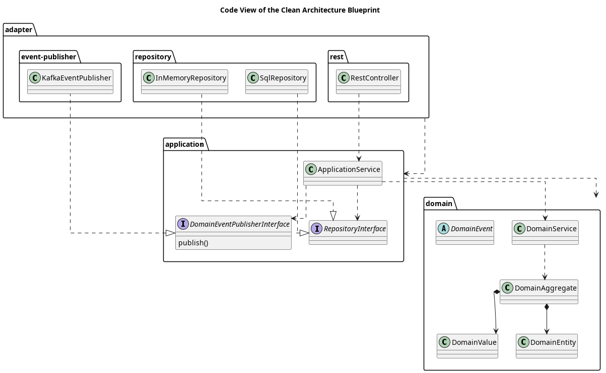

# Code View of the Clean Architecture Blueprint

## Diagram

## Description
Shows the packages, interfaces and classes of the Clean Architecture Blueprint

## Packages
| Name | Description |
|---|---|
|[adapter](../../../../software-development/architecture/blueprint/clean-architecture/adapter.md)|Contains the driving and driven adapters of the component.|
|[application](../../../../software-development/architecture/blueprint/clean-architecture/application.md)|Contains the application services implementing the orchestration of the use cases of the component|
|[domain](../../../../software-development/architecture/blueprint/clean-architecture/domain.md)|Contains the domain core of the component|
|[event-publisher](../../../../software-development/architecture/blueprint/clean-architecture/adapter/event-publisher.md)|Contains the domain event publisher adapter implementations|
|[repository](../../../../software-development/architecture/blueprint/clean-architecture/adapter/repository.md)|Contains the repository adapter implementations|
|[rest](../../../../software-development/architecture/blueprint/clean-architecture/adapter/rest.md)|Contains the REST adapter implementations|

## Interfaces
| Name | Description |
|---|---|
|[DomainEventPublisherInterface](../../../../software-development/architecture/blueprint/clean-architecture/application/domain-event-publisher-interface.md)|The interface for the domain event publisher adapters|
|[RepositoryInterface](../../../../software-development/architecture/blueprint/clean-architecture/application/repository-interface.md)|The interface for the repository adapters|

## Classes
| Name | Description |
|---|---|
|[ApplicationService](../../../../software-development/architecture/blueprint/clean-architecture/application/application-service.md)|Implements the orchestration of a use case|
|[DomainAggregate](../../../../software-development/architecture/blueprint/clean-architecture/domain/domain-aggregate.md)|The root of a graph of domain entities and domain values with constency rules spanning the whole graph|
|[DomainEntity](../../../../software-development/architecture/blueprint/clean-architecture/domain/domain-entity.md)|Represents a domain object with an identity|
|[DomainEvent](../../../../software-development/architecture/blueprint/clean-architecture/domain/domain-event.md)|Represents a relevant event that happened in the domain|
|[DomainService](../../../../software-development/architecture/blueprint/clean-architecture/domain/domain-service.md)|Implements the domain logic that is not the responsibility of a domain object.|
|[DomainValue](../../../../software-development/architecture/blueprint/clean-architecture/domain/domain-value.md)|Represents a domain object without an identity|
|[InMemoryRepository](../../../../software-development/architecture/blueprint/clean-architecture/adapter/repository/in-memory-repository.md)|Implements the repository interface for an in-memory data store for testing purposes|
|[KafkaEventPublisher](../../../../software-development/architecture/blueprint/clean-architecture/adapter/event-publisher/kafka-event-publisher.md)|Implements the domain event publisher interface for a Kafka event broker.|
|[RestController](../../../../software-development/architecture/blueprint/clean-architecture/adapter/rest/rest-controller.md)|Implements the REST controller interface for the REST API|
|[SqlRepository](../../../../software-development/architecture/blueprint/clean-architecture/adapter/repository/sql-repository.md)|Implements the repository interface for a SQL database|

## Navigation
[List of views in namespace](./views-in-namespace.md)
[List of all Views](../../../../views.md)

(generated with docs/views/code-view.md.cmb)
