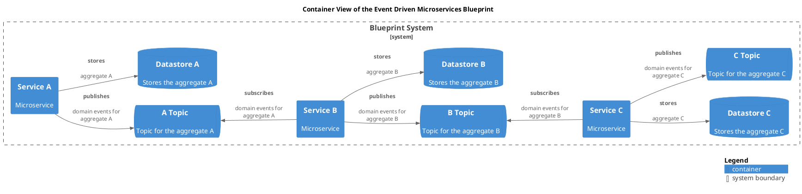

# Datastore C (Container)
## Description
Stores the aggregate C

## Technology

## Parent
[Blueprint System](../../../../../software-development/architecture/blueprint/microservices/event-driven/system.md)

## Interfaces

### Synchronous Interfaces

#### Provided Services

| From | Name | To | Technology | Description |
|---|---|---|---|---|
| [Service C](../../../../../software-development/architecture/blueprint/microservices/event-driven/service-c.md) | stores | [Datastore C](../../../../../software-development/architecture/blueprint/microservices/event-driven/datastore-c.md) |  | aggregate C |

## Container View

[Container View of the Event Driven Microservices Blueprint](../../../../../software-development/architecture/blueprint/microservices/event-driven/container-view.md)

## Navigation
[List of views in namespace](./views-in-namespace.md)

[List of all Views](../../../../../views.md)

(generated with docs/architecture-node.md.cmb)
