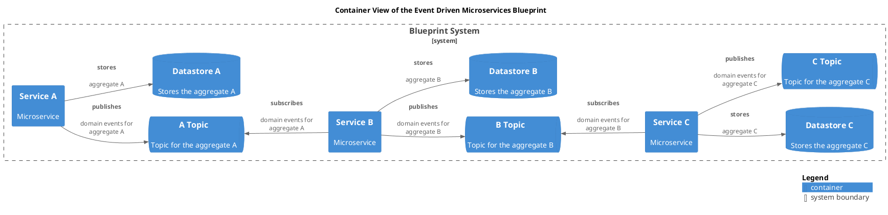

# Service C (Container)
## Description
Microservice

## Technology

## Parent
[Blueprint System](../../../../../software-development/architecture/blueprint/microservices/event-driven/system.md)

## Interfaces

### Synchronous Interfaces

#### Used Services

| From | Name | To | Technology | Description |
|---|---|---|---|---|
| [Service C](../../../../../software-development/architecture/blueprint/microservices/event-driven/service-c.md) | stores | [Datastore C](../../../../../software-development/architecture/blueprint/microservices/event-driven/datastore-c.md) |  | aggregate C |

### Asynchronous Publish/Subscribe Interfaces

#### Publishing/Producing
| From | Name | To Queue/Topic | Technology | Description |
|---|---|---|---|---|
| [Service C](../../../../../software-development/architecture/blueprint/microservices/event-driven/service-c.md) | publishes | [C Topic](../../../../../software-development/architecture/blueprint/microservices/event-driven/topic-c.md) |  | domain events for aggregate C |

#### Subscribing/Consuming
| From | Name | Queue/Topic | Technology | Description |
|---|---|---|---|---|
| [Service C](../../../../../software-development/architecture/blueprint/microservices/event-driven/service-c.md) | subscribes | [B Topic](../../../../../software-development/architecture/blueprint/microservices/event-driven/topic-b.md) |  | domain events for aggregate B |

## Container View

[Container View of the Event Driven Microservices Blueprint](../../../../../software-development/architecture/blueprint/microservices/event-driven/container-view.md)

## Navigation
[List of views in namespace](./views-in-namespace.md)

[List of all Views](../../../../../views.md)

(generated with docs/architecture-node.md.cmb)
