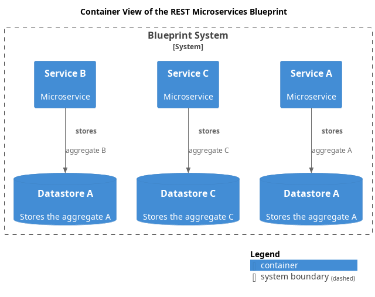

# Container View of the REST Microservices Blueprint

## Diagram

## Description
Shows the containers of the REST Microservices Blueprint

## Systems
| System | Description |
|---|---|
| [Blueprint System](../../../../../software-development/architecture/blueprint/microservices/rest/system.md)| The system of the Blueprint |

## Containers
| Container | Description |
|---|---|
| [Datastore A](../../../../../software-development/architecture/blueprint/microservices/rest/datastore-b.md)| Stores the aggregate A |
| [Datastore A](../../../../../software-development/architecture/blueprint/microservices/rest/datastore-a.md)| Stores the aggregate A |
| [Datastore C](../../../../../software-development/architecture/blueprint/microservices/rest/datastore-c.md)| Stores the aggregate C |
| [Service A](../../../../../software-development/architecture/blueprint/microservices/rest/service-a.md)| Microservice |
| [Service B](../../../../../software-development/architecture/blueprint/microservices/rest/service-b.md)| Microservice |
| [Service C](../../../../../software-development/architecture/blueprint/microservices/rest/service-c.md)| Microservice |

## Synchronous Requests
| From | Name | To | Technology | Description |
|---|---|---|---|---|
| [Service C](../../../../../software-development/architecture/blueprint/microservices/rest/service-c.md) | stores | [Datastore C](../../../../../software-development/architecture/blueprint/microservices/rest/datastore-c.md) |  | aggregate C |
| [Service B](../../../../../software-development/architecture/blueprint/microservices/rest/service-b.md) | stores | [Datastore A](../../../../../software-development/architecture/blueprint/microservices/rest/datastore-b.md) |  | aggregate B |
| [Service A](../../../../../software-development/architecture/blueprint/microservices/rest/service-a.md) | stores | [Datastore A](../../../../../software-development/architecture/blueprint/microservices/rest/datastore-a.md) |  | aggregate A |

## Navigation
[List of views in namespace](./views-in-namespace.md)

[List of all Views](../../../../../views.md)

(generated by [Overarch](https://github.com/soulspace-org/overarch) with template docs/view.md.cmb)

