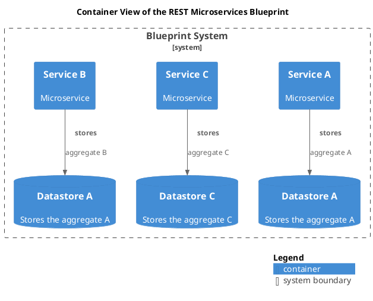

# Service C (Container)
## Description
Microservice

## Parent
[Blueprint System](../../../../../software-development/architecture/blueprint/microservices/rest/system.md)
## Outgoing Synchronous Requests 
| From | Name | To | Technology | Description |
|---|---|---|---|---|
| [Service C](../../../../../software-development/architecture/blueprint/microservices/rest/service-c.md) | stores | [Datastore C](../../../../../software-development/architecture/blueprint/microservices/rest/datastore-c.md) |  | aggregate C |

## Container View

[Container View of the REST Microservices Blueprint](../../../../../software-development/architecture/blueprint/microservices/rest/container-view.md)

## Navigation
[List of views in namespace](./views-in-namespace.md)

[List of all Views](../../../../../views.md)

(generated by [Overarch](https://github.com/soulspace-org/overarch) with template docs/node.md.cmb)
