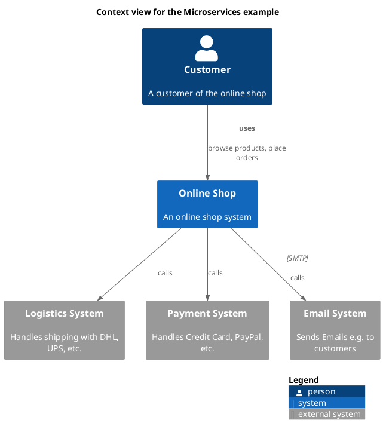

# Context view for the Microservices example

## Diagram

## Description
Shows the systems of the Microservices example and their relations

## Roles
| Person/Role | Description |
|---|---|
| [Customer](../../../../software-development/architecture/example/microservices/customer.md)| A customer of the online shop |

## Systems
| System | Description |
|---|---|
| [Email System](../../../../software-development/architecture/example/microservices/email-system.md)| Sends Emails e.g. to customers |
| [Logistics System](../../../../software-development/architecture/example/microservices/logistics-system.md)| Handles shipping with DHL, UPS, etc. |
| [Online Shop](../../../../software-development/architecture/example/microservices/online-shop.md)| An online shop system |
| [Payment System](../../../../software-development/architecture/example/microservices/payment-system.md)| Handles Credit Card, PayPal, etc. |

## Synchronous Requests
| From | Name | To | Technology | Description |
|---|---|---|---|---|
| [Online Shop](../../../../software-development/architecture/example/microservices/online-shop.md) |  | [Payment System](../../../../software-development/architecture/example/microservices/payment-system.md) | calls |
| [Online Shop](../../../../software-development/architecture/example/microservices/online-shop.md) |  | [Email System](../../../../software-development/architecture/example/microservices/email-system.md) | calls |
| [Online Shop](../../../../software-development/architecture/example/microservices/online-shop.md) |  | [Logistics System](../../../../software-development/architecture/example/microservices/logistics-system.md) | calls |
| [Customer](../../../../software-development/architecture/example/microservices/customer.md) | uses | [Online Shop](../../../../software-development/architecture/example/microservices/online-shop.md) | browse products, place orders |

## Navigation
[List of views in namespace](./views-in-namespace.md)

[List of all Views](../../../../views.md)

(generated by [Overarch](https://github.com/soulspace-org/overarch) with template docs/views/view.md.cmb)

