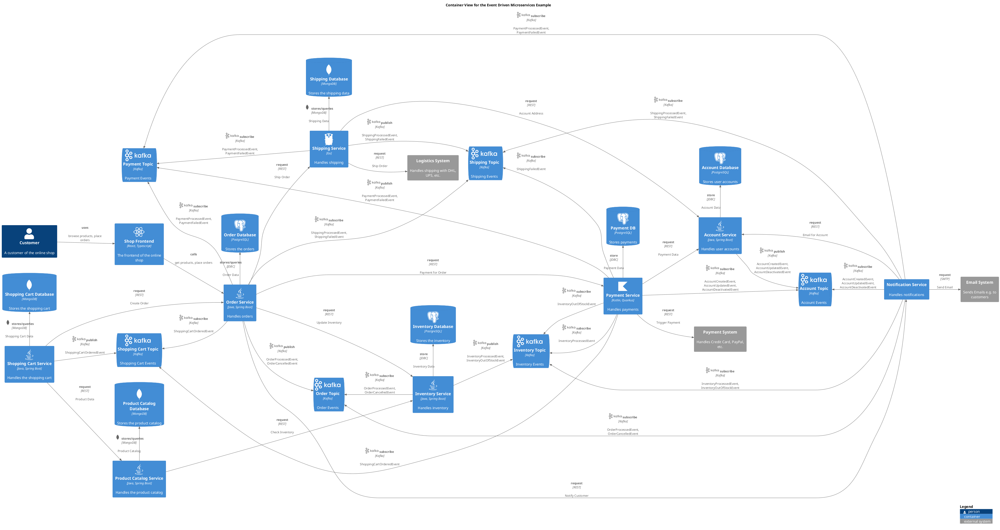

# Container View for the Event Driven Microservices Example

## Diagram

## Description
Shows the containers of the Microservices Example and their event driven communication

## Roles
| Person/Role | Description |
|---|---|
| [Customer](../../../../software-development/architecture/example/microservices/customer.md)| A customer of the online shop |

## Systems
| System | Description |
|---|---|
| [Email System](../../../../software-development/architecture/example/microservices/email-system.md)| Sends Emails e.g. to customers |
| [Logistics System](../../../../software-development/architecture/example/microservices/logistics-system.md)| Handles shipping with DHL, UPS, etc. |
| [Payment System](../../../../software-development/architecture/example/microservices/payment-system.md)| Handles Credit Card, PayPal, etc. |

## Containers
| Container | Description |
|---|---|
| [Account Database](../../../../software-development/architecture/example/microservices/account-db.md)| Stores user accounts |
| [Account Service](../../../../software-development/architecture/example/microservices/account-service.md)| Handles user accounts |
| [Account Topic](../../../../software-development/architecture/example/microservices/account-topic.md)| Account Events |
| [Inventory Database](../../../../software-development/architecture/example/microservices/inventory-db.md)| Stores the inventory |
| [Inventory Service](../../../../software-development/architecture/example/microservices/inventory-service.md)| Handles inventory |
| [Inventory Topic](../../../../software-development/architecture/example/microservices/inventory-topic.md)| Inventory Events |
| [Notification Service](../../../../software-development/architecture/example/microservices/notification-service.md)| Handles notifications |
| [Order Database](../../../../software-development/architecture/example/microservices/order-db.md)| Stores the orders |
| [Order Service](../../../../software-development/architecture/example/microservices/order-service.md)| Handles orders |
| [Order Topic](../../../../software-development/architecture/example/microservices/order-topic.md)| Order Events |
| [Payment DB](../../../../software-development/architecture/example/microservices/payment-db.md)| Stores payments |
| [Payment Service](../../../../software-development/architecture/example/microservices/payment-service.md)| Handles payments |
| [Payment Topic](../../../../software-development/architecture/example/microservices/payment-topic.md)| Payment Events |
| [Product Catalog Database](../../../../software-development/architecture/example/microservices/product-catalog-db.md)| Stores the product catalog |
| [Product Catalog Service](../../../../software-development/architecture/example/microservices/product-catalog-service.md)| Handles the product catalog |
| [Shipping Database](../../../../software-development/architecture/example/microservices/shipping-db.md)| Stores the shipping data |
| [Shipping Service](../../../../software-development/architecture/example/microservices/shipping-service.md)| Handles shipping |
| [Shipping Topic](../../../../software-development/architecture/example/microservices/shipping-topic.md)| Shipping Events |
| [Shop Frontend](../../../../software-development/architecture/example/microservices/shop-frontend.md)| The frontend of the online shop |
| [Shopping Cart Database](../../../../software-development/architecture/example/microservices/shopping-cart-db.md)| Stores the shopping cart |
| [Shopping Cart Service](../../../../software-development/architecture/example/microservices/shopping-cart-service.md)| Handles the shopping cart |
| [Shopping Cart Topic](../../../../software-development/architecture/example/microservices/shopping-cart-topic.md)| Shopping Cart Events |

## Synchronous Requests
| From | Name | To | Technology | Description |
|---|---|---|---|---|
| [Shop Frontend](../../../../software-development/architecture/example/microservices/shop-frontend.md) | calls | [Order Service](../../../../software-development/architecture/example/microservices/order-service.md) |  | get products, place orders |
| [Payment Service](../../../../software-development/architecture/example/microservices/payment-service.md) | request | [Payment System](../../../../software-development/architecture/example/microservices/payment-system.md) | REST | Trigger Payment |
| [Order Service](../../../../software-development/architecture/example/microservices/order-service.md) | request | [Inventory Service](../../../../software-development/architecture/example/microservices/inventory-service.md) | REST | Update Inventory |
| [Notification Service](../../../../software-development/architecture/example/microservices/notification-service.md) | request | [Account Service](../../../../software-development/architecture/example/microservices/account-service.md) | REST | Email for Account |
| [Shipping Service](../../../../software-development/architecture/example/microservices/shipping-service.md) | request | [Logistics System](../../../../software-development/architecture/example/microservices/logistics-system.md) | REST | Ship Order |
| [Shopping Cart Service](../../../../software-development/architecture/example/microservices/shopping-cart-service.md) | request | [Product Catalog Service](../../../../software-development/architecture/example/microservices/product-catalog-service.md) | REST | Product Data |
| [Order Service](../../../../software-development/architecture/example/microservices/order-service.md) | request | [Payment Service](../../../../software-development/architecture/example/microservices/payment-service.md) | REST | Payment for Order |
| [Shipping Service](../../../../software-development/architecture/example/microservices/shipping-service.md) | request | [Account Service](../../../../software-development/architecture/example/microservices/account-service.md) | REST | Account Address |
| [Shopping Cart Service](../../../../software-development/architecture/example/microservices/shopping-cart-service.md) | request | [Order Service](../../../../software-development/architecture/example/microservices/order-service.md) | REST | Create Order |
| [Order Service](../../../../software-development/architecture/example/microservices/order-service.md) | request | [Notification Service](../../../../software-development/architecture/example/microservices/notification-service.md) | REST | Notify Customer |
| [Notification Service](../../../../software-development/architecture/example/microservices/notification-service.md) | request | [Email System](../../../../software-development/architecture/example/microservices/email-system.md) | SMTP | Send Email |
| [Payment Service](../../../../software-development/architecture/example/microservices/payment-service.md) | request | [Account Service](../../../../software-development/architecture/example/microservices/account-service.md) | REST | Payment Data |
| [Order Service](../../../../software-development/architecture/example/microservices/order-service.md) | request | [Shipping Service](../../../../software-development/architecture/example/microservices/shipping-service.md) | REST | Ship Order |
| [Product Catalog Service](../../../../software-development/architecture/example/microservices/product-catalog-service.md) | request | [Inventory Service](../../../../software-development/architecture/example/microservices/inventory-service.md) | REST | Check Inventory |
| [Order Service](../../../../software-development/architecture/example/microservices/order-service.md) | store | [Order Database](../../../../software-development/architecture/example/microservices/order-db.md) | JDBC | Order Data |
| [Inventory Service](../../../../software-development/architecture/example/microservices/inventory-service.md) | store | [Inventory Database](../../../../software-development/architecture/example/microservices/inventory-db.md) | JDBC | Inventory Data |
| [Product Catalog Service](../../../../software-development/architecture/example/microservices/product-catalog-service.md) | store | [Product Catalog Database](../../../../software-development/architecture/example/microservices/product-catalog-db.md) | MongoDB | Product Catalog |
| [Account Service](../../../../software-development/architecture/example/microservices/account-service.md) | store | [Account Database](../../../../software-development/architecture/example/microservices/account-db.md) | JDBC | Account Data |
| [Shopping Cart Service](../../../../software-development/architecture/example/microservices/shopping-cart-service.md) | store | [Shopping Cart Database](../../../../software-development/architecture/example/microservices/shopping-cart-db.md) | MongoDB | Shopping Cart Data |
| [Payment Service](../../../../software-development/architecture/example/microservices/payment-service.md) | store | [Payment DB](../../../../software-development/architecture/example/microservices/payment-db.md) | JDBC | Payment Data |
| [Shipping Service](../../../../software-development/architecture/example/microservices/shipping-service.md) | store | [Shipping Database](../../../../software-development/architecture/example/microservices/shipping-db.md) | MongoDB | Shipping Data |
| [Customer](../../../../software-development/architecture/example/microservices/customer.md) | uses | [Shop Frontend](../../../../software-development/architecture/example/microservices/shop-frontend.md) |  | browse products, place orders |

## Asynchronous Publish/Produce
| From | Name | To | Technology | Description |
|---|---|---|---|---|
| [Shipping Service](../../../../software-development/architecture/example/microservices/shipping-service.md) | publish | [Shipping Topic](../../../../software-development/architecture/example/microservices/shipping-topic.md) | Kafka | ShippingProcessedEvent, ShippingFailedEvent |
| [Account Service](../../../../software-development/architecture/example/microservices/account-service.md) | publish | [Account Topic](../../../../software-development/architecture/example/microservices/account-topic.md) | Kafka | AccountCreatedEvent, AccountUpdatedEvent, AccountDeactivatedEvent |
| [Shopping Cart Service](../../../../software-development/architecture/example/microservices/shopping-cart-service.md) | publish | [Shopping Cart Topic](../../../../software-development/architecture/example/microservices/shopping-cart-topic.md) | Kafka | ShoppingCartOrderedEvent |
| [Payment Service](../../../../software-development/architecture/example/microservices/payment-service.md) | publish | [Payment Topic](../../../../software-development/architecture/example/microservices/payment-topic.md) | Kafka | PaymentProcessedEvent, PaymentFailedEvent |
| [Inventory Service](../../../../software-development/architecture/example/microservices/inventory-service.md) | publish | [Inventory Topic](../../../../software-development/architecture/example/microservices/inventory-topic.md) | Kafka | InventoryProcessedEvent, InventoryOutOfStockEvent |
| [Order Service](../../../../software-development/architecture/example/microservices/order-service.md) | publish | [Order Topic](../../../../software-development/architecture/example/microservices/order-topic.md) | Kafka | OrderProcessedEvent, OrderCancelledEvent |

## Asynchronous Subscribe/Consume
| From | Name | To | Technology | Description |
|---|---|---|---|---|
| [Payment Service](../../../../software-development/architecture/example/microservices/payment-service.md) | subscribe | [Shipping Topic](../../../../software-development/architecture/example/microservices/shipping-topic.md) | Kafka | ShippingFailedEvent |
| [Inventory Service](../../../../software-development/architecture/example/microservices/inventory-service.md) | subscribe | [Order Topic](../../../../software-development/architecture/example/microservices/order-topic.md) | Kafka | OrderProcessedEvent, OrderCancelledEvent |
| [Order Service](../../../../software-development/architecture/example/microservices/order-service.md) | subscribe | [Payment Topic](../../../../software-development/architecture/example/microservices/payment-topic.md) | Kafka | PaymentProcessedEvent, PaymentFailedEvent |
| [Shipping Service](../../../../software-development/architecture/example/microservices/shipping-service.md) | subscribe | [Payment Topic](../../../../software-development/architecture/example/microservices/payment-topic.md) | Kafka | PaymentProcessedEvent, PaymentFailedEvent |
| [Notification Service](../../../../software-development/architecture/example/microservices/notification-service.md) | subscribe | [Order Topic](../../../../software-development/architecture/example/microservices/order-topic.md) | Kafka | OrderProcessedEvent, OrderCancelledEvent |
| [Notification Service](../../../../software-development/architecture/example/microservices/notification-service.md) | subscribe | [Inventory Topic](../../../../software-development/architecture/example/microservices/inventory-topic.md) | Kafka | InventoryProcessedEvent, InventoryOutOfStockEvent |
| [Notification Service](../../../../software-development/architecture/example/microservices/notification-service.md) | subscribe | [Shipping Topic](../../../../software-development/architecture/example/microservices/shipping-topic.md) | Kafka | ShippingProcessedEvent, ShippingFailedEvent |
| [Order Service](../../../../software-development/architecture/example/microservices/order-service.md) | subscribe | [Shopping Cart Topic](../../../../software-development/architecture/example/microservices/shopping-cart-topic.md) | Kafka | ShoppingCartOrderedEvent |
| [Payment Service](../../../../software-development/architecture/example/microservices/payment-service.md) | subscribe | [Inventory Topic](../../../../software-development/architecture/example/microservices/inventory-topic.md) | Kafka | InventoryOutOfStockEvent |
| [Payment Service](../../../../software-development/architecture/example/microservices/payment-service.md) | subscribe | [Account Topic](../../../../software-development/architecture/example/microservices/account-topic.md) | Kafka | AccountCreatedEvent, AccountUpdatedEvent, AccountDeactivatedEvent |
| [Notification Service](../../../../software-development/architecture/example/microservices/notification-service.md) | subscribe | [Payment Topic](../../../../software-development/architecture/example/microservices/payment-topic.md) | Kafka | PaymentProcessedEvent, PaymentFailedEvent |
| [Payment Service](../../../../software-development/architecture/example/microservices/payment-service.md) | subscribe | [Inventory Topic](../../../../software-development/architecture/example/microservices/inventory-topic.md) | Kafka | InventoryProcessedEvent |
| [Payment Service](../../../../software-development/architecture/example/microservices/payment-service.md) | subscribe | [Shopping Cart Topic](../../../../software-development/architecture/example/microservices/shopping-cart-topic.md) | Kafka | ShoppingCartOrderedEvent |
| [Order Service](../../../../software-development/architecture/example/microservices/order-service.md) | subscribe | [Shipping Topic](../../../../software-development/architecture/example/microservices/shipping-topic.md) | Kafka | ShippingProcessedEvent, ShippingFailedEvent |
| [Notification Service](../../../../software-development/architecture/example/microservices/notification-service.md) | subscribe | [Account Topic](../../../../software-development/architecture/example/microservices/account-topic.md) | Kafka | AccountCreatedEvent, AccountUpdatedEvent, AccountDeactivatedEvent |

## Navigation
[List of views in namespace](./views-in-namespace.md)

[List of all Views](../../../../views.md)

(generated by [Overarch](https://github.com/soulspace-org/overarch) with template docs/views/view.md.cmb)

