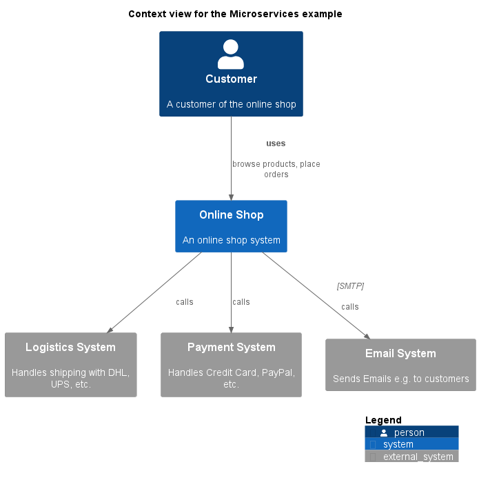

# Logistics System (System)
## Description
Handles shipping with DHL, UPS, etc.

## Tags
advanced

## Documentation
This is an external logistics system that is used by the online shop
system to handle the actual shipping with companies like DHL or UPS.
## Incoming Synchronous Requests 
| From | Name | To | Technology | Description |
|---|---|---|---|---|
| [Online Shop](../../../../software-development/architecture/example/microservices/online-shop.md) |  | [Logistics System](../../../../software-development/architecture/example/microservices/logistics-system.md) |  | calls |
| [Shipping Service](../../../../software-development/architecture/example/microservices/shipping-service.md) | request | [Logistics System](../../../../software-development/architecture/example/microservices/logistics-system.md) | REST | Ship Order |

## System Context View

[Context view for the Microservices example](../../../../software-development/architecture/example/microservices/context-view.md)

## Navigation
[List of views in namespace](./views-in-namespace.md)

[List of all Views](../../../../views.md)

(generated by [Overarch](https://github.com/soulspace-org/overarch) with template docs/node.md.cmb)
