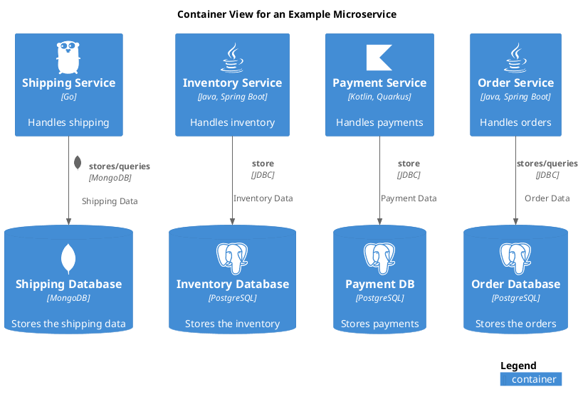

# Container View for an Example Microservice

## Diagram

## Description
Shows the containers of a simple Microservice
## Containers
| Name | Description |
|---|---|
| [Inventory Database](../../../../software-development/architecture/example/microservices/inventory-db.md) | Stores the inventory |
| [Inventory Service](../../../../software-development/architecture/example/microservices/inventory-service.md) | Handles inventory |
| [Order Database](../../../../software-development/architecture/example/microservices/order-db.md) | Stores the orders |
| [Order Service](../../../../software-development/architecture/example/microservices/order-service.md) | Handles orders |
| [Payment DB](../../../../software-development/architecture/example/microservices/payment-db.md) | Stores payments |
| [Payment Service](../../../../software-development/architecture/example/microservices/payment-service.md) | Handles payments |
| [Shipping Database](../../../../software-development/architecture/example/microservices/shipping-db.md) | Stores the shipping data |
| [Shipping Service](../../../../software-development/architecture/example/microservices/shipping-service.md) | Handles shipping |

## Navigation
[List of views in namespace](./views-in-namespace.md)
[List of all Views](../../../../views.md)

(generated with docs/views/container-view.md.cmb)
