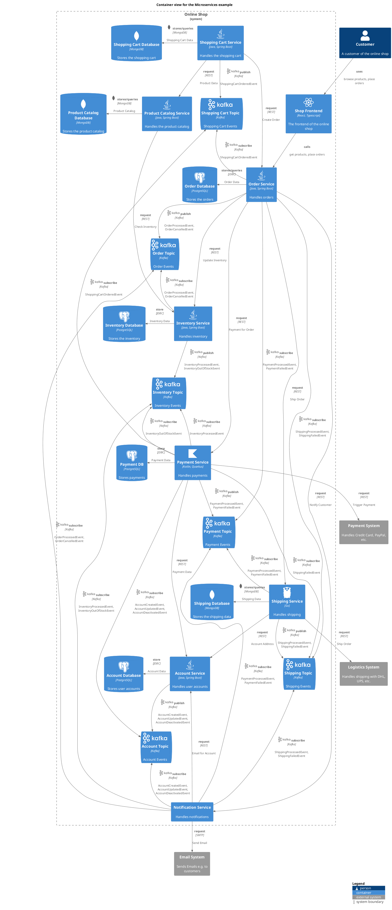

# Shipping Topic (Container)
## Description
Shipping Events

## Parent
[Online Shop](../../../../software-development/architecture/example/microservices/online-shop.md)

## Technology
Kafka

## Tags
event-driven, simple
## Incoming Asynchronous Publish/Produce 
| From | Name | To | Technology | Description |
|---|---|---|---|---|
| [Shipping Service](../../../../software-development/architecture/example/microservices/shipping-service.md) | publish | [Shipping Topic](../../../../software-development/architecture/example/microservices/shipping-topic.md) | Kafka | ShippingProcessedEvent, ShippingFailedEvent |
## Incoming Asynchronous Subscribe/Consume 
| From | Name | To | Technology | Description |
|---|---|---|---|---|
| [Order Service](../../../../software-development/architecture/example/microservices/order-service.md) | subscribe | [Shipping Topic](../../../../software-development/architecture/example/microservices/shipping-topic.md) | Kafka | ShippingProcessedEvent, ShippingFailedEvent |
| [Payment Service](../../../../software-development/architecture/example/microservices/payment-service.md) | subscribe | [Shipping Topic](../../../../software-development/architecture/example/microservices/shipping-topic.md) | Kafka | ShippingFailedEvent |
| [Notification Service](../../../../software-development/architecture/example/microservices/notification-service.md) | subscribe | [Shipping Topic](../../../../software-development/architecture/example/microservices/shipping-topic.md) | Kafka | ShippingProcessedEvent, ShippingFailedEvent |

## Container View

[Container view for the Microservices example](../../../../software-development/architecture/example/microservices/container-view.md)

## Navigation
[List of views in namespace](./views-in-namespace.md)

[List of all Views](../../../../views.md)

(generated by [Overarch](https://github.com/soulspace-org/overarch) with template docs/node.md.cmb)
