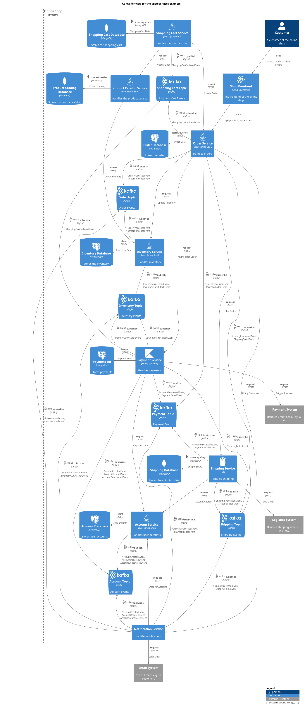

# Shopping Cart Database (Container)
## Description
Stores the shopping cart

## Parent
[Online Shop](../../../../software-development/architecture/example/microservices/online-shop.md)

## Technology
MongoDB

## Tags
advanced, datastore
## Incoming Synchronous Requests 
| From | Name | To | Technology | Description |
|---|---|---|---|---|
| [Shopping Cart Service](../../../../software-development/architecture/example/microservices/shopping-cart-service.md) | store | [Shopping Cart Database](../../../../software-development/architecture/example/microservices/shopping-cart-db.md) | Shopping Cart Data |

## Container View

[Container view for the Microservices example](../../../../software-development/architecture/example/microservices/container-view.md)

## Navigation
[List of views in namespace](./views-in-namespace.md)

[List of all Views](../../../../views.md)

(generated by [Overarch](https://github.com/soulspace-org/overarch) with template docs/node.md.cmb)
