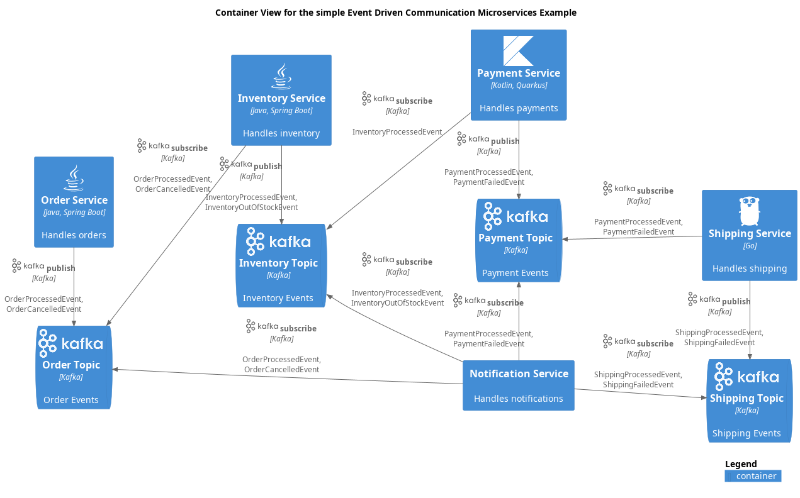

# Container View for the simple Event Driven Communication Microservices Example

## Diagram

## Description
Shows the containers of the simple Microservices Example and their event driven communication.

## Documentation
With 'Event Driven Architecture', the services communicate by publishing and subscribing to topics.
The communication is asynchronous and the services are temporarily decoupled.
The orchestration of the process is done by the connection of the services to the topics
and the event processing policies on each service.
         
This architecture is more resilient to changes and failures.
A service can be added or removed without affecting the other services.
Events are stored in the topic and will be processed when the service is up.

The process could be reconfigured by changing the connections to the topics and the policies.
This is also called a 'Pipes and Filters' architecture.

## Containers
| Container | Description |
|---|---|
| [Inventory Service](../../../../software-development/architecture/example/microservices/inventory-service.md)| Handles inventory |
| [Inventory Topic](../../../../software-development/architecture/example/microservices/inventory-topic.md)| Inventory Events |
| [Notification Service](../../../../software-development/architecture/example/microservices/notification-service.md)| Handles notifications |
| [Order Service](../../../../software-development/architecture/example/microservices/order-service.md)| Handles orders |
| [Order Topic](../../../../software-development/architecture/example/microservices/order-topic.md)| Order Events |
| [Payment Service](../../../../software-development/architecture/example/microservices/payment-service.md)| Handles payments |
| [Payment Topic](../../../../software-development/architecture/example/microservices/payment-topic.md)| Payment Events |
| [Shipping Service](../../../../software-development/architecture/example/microservices/shipping-service.md)| Handles shipping |
| [Shipping Topic](../../../../software-development/architecture/example/microservices/shipping-topic.md)| Shipping Events |

## Asynchronous Publish/Produce
| From | Name | To | Technology | Description |
|---|---|---|---|---|
| [Inventory Service](../../../../software-development/architecture/example/microservices/inventory-service.md) | publish | [Inventory Topic](../../../../software-development/architecture/example/microservices/inventory-topic.md) | Kafka | InventoryProcessedEvent, InventoryOutOfStockEvent |
| [Payment Service](../../../../software-development/architecture/example/microservices/payment-service.md) | publish | [Payment Topic](../../../../software-development/architecture/example/microservices/payment-topic.md) | Kafka | PaymentProcessedEvent, PaymentFailedEvent |
| [Order Service](../../../../software-development/architecture/example/microservices/order-service.md) | publish | [Order Topic](../../../../software-development/architecture/example/microservices/order-topic.md) | Kafka | OrderProcessedEvent, OrderCancelledEvent |
| [Shipping Service](../../../../software-development/architecture/example/microservices/shipping-service.md) | publish | [Shipping Topic](../../../../software-development/architecture/example/microservices/shipping-topic.md) | Kafka | ShippingProcessedEvent, ShippingFailedEvent |

## Asynchronous Subscribe/Consume
| From | Name | To | Technology | Description |
|---|---|---|---|---|
| [Notification Service](../../../../software-development/architecture/example/microservices/notification-service.md) | subscribe | [Inventory Topic](../../../../software-development/architecture/example/microservices/inventory-topic.md) | Kafka | InventoryProcessedEvent, InventoryOutOfStockEvent |
| [Inventory Service](../../../../software-development/architecture/example/microservices/inventory-service.md) | subscribe | [Order Topic](../../../../software-development/architecture/example/microservices/order-topic.md) | Kafka | OrderProcessedEvent, OrderCancelledEvent |
| [Payment Service](../../../../software-development/architecture/example/microservices/payment-service.md) | subscribe | [Inventory Topic](../../../../software-development/architecture/example/microservices/inventory-topic.md) | Kafka | InventoryProcessedEvent |
| [Notification Service](../../../../software-development/architecture/example/microservices/notification-service.md) | subscribe | [Payment Topic](../../../../software-development/architecture/example/microservices/payment-topic.md) | Kafka | PaymentProcessedEvent, PaymentFailedEvent |
| [Shipping Service](../../../../software-development/architecture/example/microservices/shipping-service.md) | subscribe | [Payment Topic](../../../../software-development/architecture/example/microservices/payment-topic.md) | Kafka | PaymentProcessedEvent, PaymentFailedEvent |
| [Notification Service](../../../../software-development/architecture/example/microservices/notification-service.md) | subscribe | [Shipping Topic](../../../../software-development/architecture/example/microservices/shipping-topic.md) | Kafka | ShippingProcessedEvent, ShippingFailedEvent |
| [Notification Service](../../../../software-development/architecture/example/microservices/notification-service.md) | subscribe | [Order Topic](../../../../software-development/architecture/example/microservices/order-topic.md) | Kafka | OrderProcessedEvent, OrderCancelledEvent |

## Navigation
[List of views in namespace](./views-in-namespace.md)

[List of all Views](../../../../views.md)

(generated by [Overarch](https://github.com/soulspace-org/overarch) with template docs/view.md.cmb)

