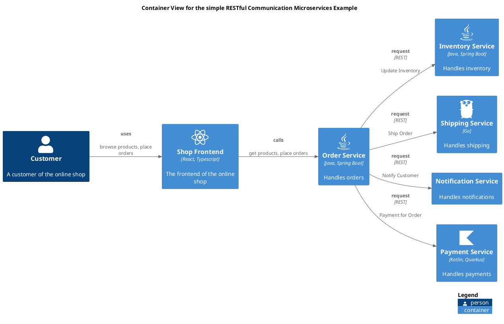

# Container View for the simple RESTful Communication Microservices Example

## Diagram

## Description
Shows the containers of the simple Microservices Example and their RESTful communication.

## Documentation
With RESTful communication, the services communicateby calling each
         other's RESTful APIs in a request/response pattern.
         The upstream service blocks until the downstream service responds.
         So the services are tightly coupled and the communication is synchronous. 
         If a downstream service is slow, the upstream service has to wait for the
         downstream service and as a result, it also responds slowly.
         If the downstream service is down, the upstream service also fails.
         Also one service has to know the details of the other service's API
         and is responsible for the orchestration of the process.

## Roles
| Person/Role | Description |
|---|---|
| [Customer](../../../../software-development/architecture/example/microservices/customer.md)| A customer of the online shop |

## Containers
| Container | Description |
|---|---|
| [Inventory Service](../../../../software-development/architecture/example/microservices/inventory-service.md)| Handles inventory |
| [Notification Service](../../../../software-development/architecture/example/microservices/notification-service.md)| Handles notifications |
| [Order Service](../../../../software-development/architecture/example/microservices/order-service.md)| Handles orders |
| [Payment Service](../../../../software-development/architecture/example/microservices/payment-service.md)| Handles payments |
| [Shipping Service](../../../../software-development/architecture/example/microservices/shipping-service.md)| Handles shipping |
| [Shop Frontend](../../../../software-development/architecture/example/microservices/shop-frontend.md)| The frontend of the online shop |

## Synchronous Requests
| From | Name | To | Technology | Description |
|---|---|---|---|---|
| [Shop Frontend](../../../../software-development/architecture/example/microservices/shop-frontend.md) | calls | [Order Service](../../../../software-development/architecture/example/microservices/order-service.md) |  | get products, place orders |
| [Order Service](../../../../software-development/architecture/example/microservices/order-service.md) | request | [Inventory Service](../../../../software-development/architecture/example/microservices/inventory-service.md) | REST | Update Inventory |
| [Order Service](../../../../software-development/architecture/example/microservices/order-service.md) | request | [Payment Service](../../../../software-development/architecture/example/microservices/payment-service.md) | REST | Payment for Order |
| [Order Service](../../../../software-development/architecture/example/microservices/order-service.md) | request | [Notification Service](../../../../software-development/architecture/example/microservices/notification-service.md) | REST | Notify Customer |
| [Order Service](../../../../software-development/architecture/example/microservices/order-service.md) | request | [Shipping Service](../../../../software-development/architecture/example/microservices/shipping-service.md) | REST | Ship Order |
| [Customer](../../../../software-development/architecture/example/microservices/customer.md) | uses | [Shop Frontend](../../../../software-development/architecture/example/microservices/shop-frontend.md) |  | browse products, place orders |

## Navigation
[List of views in namespace](./views-in-namespace.md)

[List of all Views](../../../../views.md)

(generated by [Overarch](https://github.com/soulspace-org/overarch) with template docs/views/view.md.cmb)

