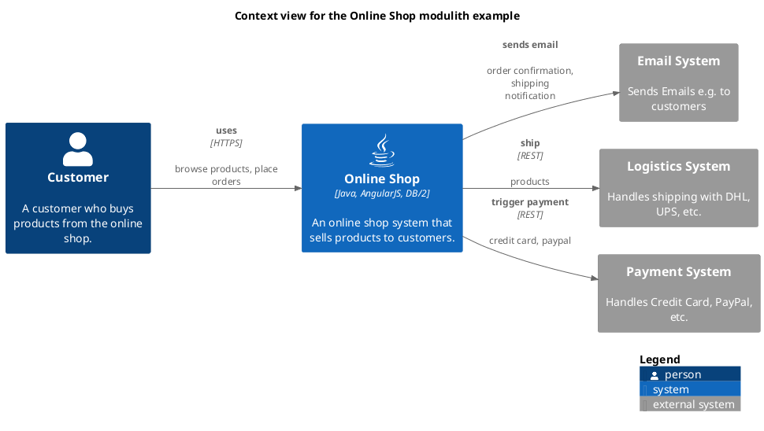

# Context view for the Online Shop modulith example

## Diagram

## Description
Shows the systems of the Online Shop modulith example and their relations
## User Roles
| Name | Description |
|---|---|
| [Customer](../../../../software-development/architecture/example/modulith/customer.md) | A customer who buys products from the online shop. |
## Systems
| Name | Description |
|---|---|
| [Email System](../../../../software-development/architecture/example/modulith/email-system.md) | Sends Emails e.g. to customers |
| [Logistics System](../../../../software-development/architecture/example/modulith/logistics-system.md) | Handles shipping with DHL, UPS, etc. |
| [Online Shop](../../../../software-development/architecture/example/modulith/online-shop-system.md) | An online shop system that sells products to customers. |
| [Payment System](../../../../software-development/architecture/example/modulith/payment-system.md) | Handles Credit Card, PayPal, etc. |

## Navigation
[List of views in namespace](./views-in-namespace.md)
[List of all Views](../../../../views.md)

(generated with docs/views/context-view.md.cmb)
