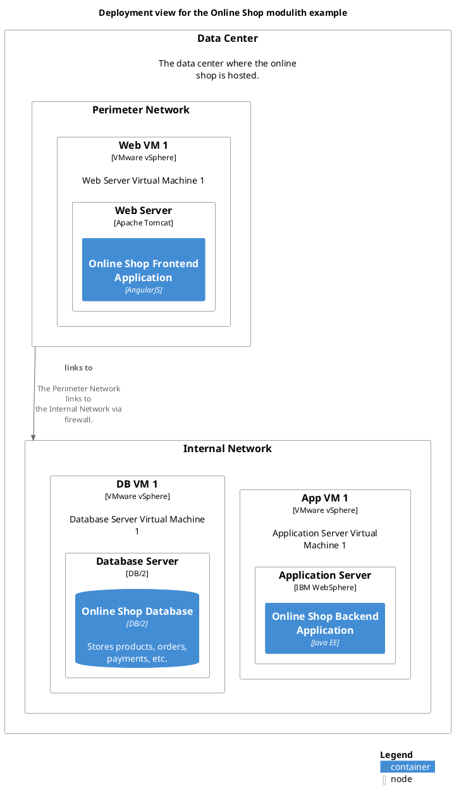

# Deployment view for the Online Shop modulith example

## Diagram

## Description
Shows the deployment of the Online Shop modulith example

## Deployment Nodes
| Node | Description |
|---|---|
| [App VM 1](../../../../software-development/architecture/example/modulith/app-vm1.md)| Application Server Virtual Machine 1 |
| [Application Server](../../../../software-development/architecture/example/modulith/application-server.md)|  |
| [DB VM 1](../../../../software-development/architecture/example/modulith/db-vm1.md)| Database Server Virtual Machine 1 |
| [Data Center](../../../../software-development/architecture/example/modulith/data-center.md)| The data center where the online shop is hosted. |
| [Database Server](../../../../software-development/architecture/example/modulith/db-server.md)|  |
| [Internal Network](../../../../software-development/architecture/example/modulith/internal-network.md)|  |
| [Perimeter Network](../../../../software-development/architecture/example/modulith/perimeter-network.md)|  |
| [Web Server](../../../../software-development/architecture/example/modulith/web-server.md)|  |
| [Web VM 1](../../../../software-development/architecture/example/modulith/web-vm1.md)| Web Server Virtual Machine 1 |

## Navigation
[List of views in namespace](./views-in-namespace.md)

[List of all Views](../../../../views.md)

(generated by [Overarch](https://github.com/soulspace-org/overarch) with template docs/views/view.md.cmb)

