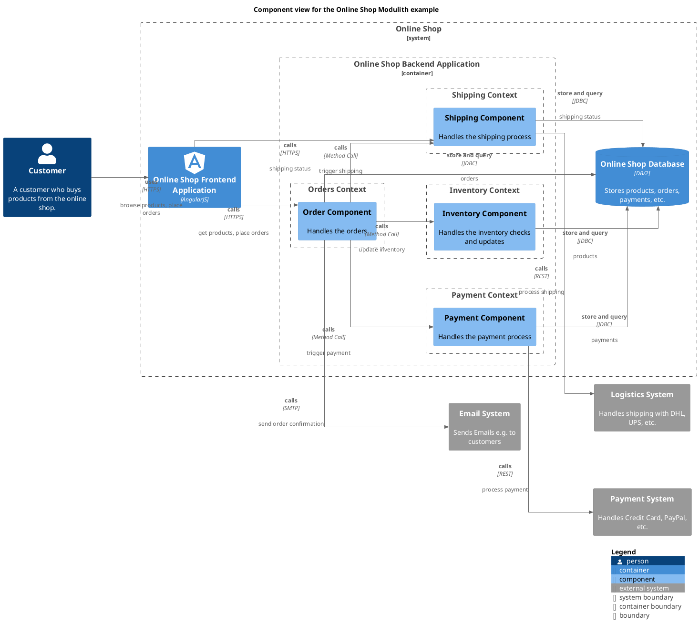

# Order Component (Component)
## Description
Handles the orders

## Parent
[Orders Context](../../../../software-development/architecture/example/modulith/orders.md)
## Incoming Synchronous Requests 
| From | Name | To | Technology | Description |
|---|---|---|---|---|
| [Online Shop Frontend Application](../../../../software-development/architecture/example/modulith/online-shop-frontend.md) | calls | [Order Component](../../../../software-development/architecture/example/modulith/order-component.md) | get products, place orders |
## Outgoing Synchronous Requests 
| From | Name | To | Technology | Description |
|---|---|---|---|---|
| [Order Component](../../../../software-development/architecture/example/modulith/order-component.md) | calls | [Shipping Component](../../../../software-development/architecture/example/modulith/shipping-component.md) | trigger shipping |
| [Order Component](../../../../software-development/architecture/example/modulith/order-component.md) | calls | [Inventory Component](../../../../software-development/architecture/example/modulith/inventory-component.md) | update inventory |
| [Order Component](../../../../software-development/architecture/example/modulith/order-component.md) | calls | [Payment Component](../../../../software-development/architecture/example/modulith/payment-component.md) | trigger payment |
| [Order Component](../../../../software-development/architecture/example/modulith/order-component.md) | calls | [Email System](../../../../software-development/architecture/example/modulith/email-system.md) | send order confirmation |
| [Order Component](../../../../software-development/architecture/example/modulith/order-component.md) | store and query | [Online Shop Database](../../../../software-development/architecture/example/modulith/online-shop-db.md) | orders |

## Component View

[Component view for the Online Shop Modulith example](../../../../software-development/architecture/example/modulith/component-view.md)

## Navigation
[List of views in namespace](./views-in-namespace.md)

[List of all Views](../../../../views.md)

(generated by [Overarch](https://github.com/soulspace-org/overarch) with template docs/node.md.cmb)
