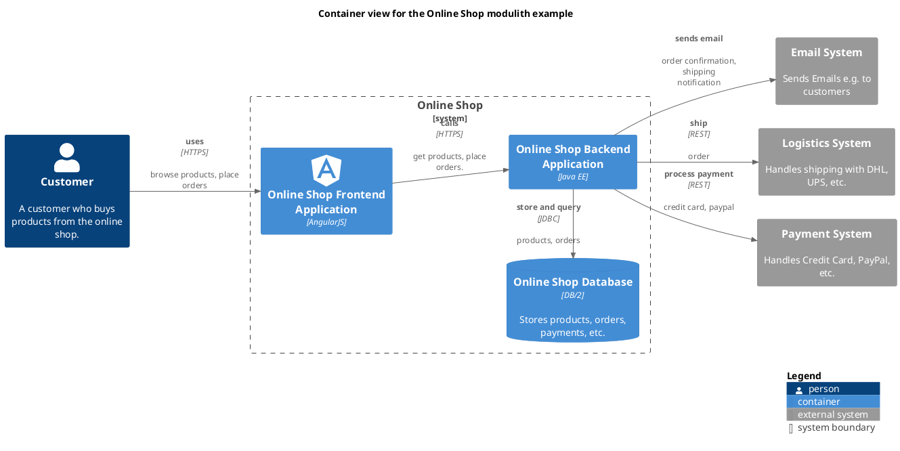

# Orders Context (Context-boundary)
## Description

## Parent
[Online Shop Backend Application](../../../../software-development/architecture/example/modulith/online-shop-backend.md)

## Documentation
The orders context is responsible for managing the orders.
## Components
| Component | Description |
|---|---|
| [Order Component](../../../../software-development/architecture/example/modulith/order-component.md)| Handles the orders |

## Container View

[Container view for the Online Shop modulith example](../../../../software-development/architecture/example/modulith/container-view.md)

## Navigation
[List of views in namespace](./views-in-namespace.md)

[List of all Views](../../../../views.md)

(generated by [Overarch](https://github.com/soulspace-org/overarch) with template docs/node.md.cmb)
