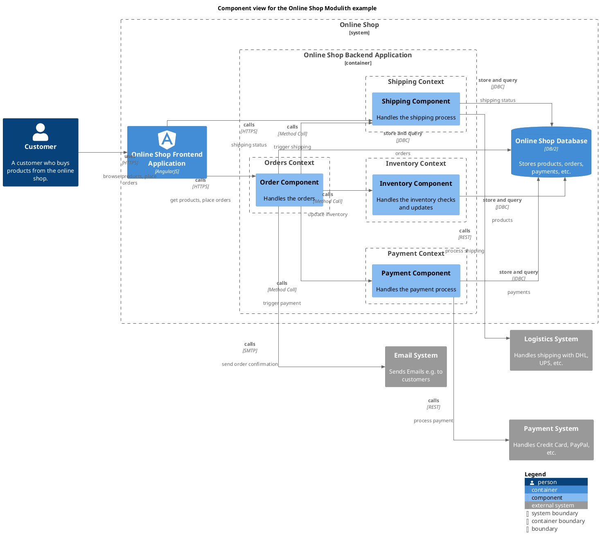

# Payment Component (Component)
## Description
Handles the payment process

## Technology

## Parent
[Payment Context](../../../../software-development/architecture/example/modulith/payment.md)

## Interfaces

### Synchronous Interfaces

#### Provided Services

| From | Name | To | Technology | Description |
|---|---|---|---|---|
| [Order Component](../../../../software-development/architecture/example/modulith/order-component.md) | calls | [Payment Component](../../../../software-development/architecture/example/modulith/payment-component.md) | Method Call | trigger payment |

#### Used Services

| From | Name | To | Technology | Description |
|---|---|---|---|---|
| [Payment Component](../../../../software-development/architecture/example/modulith/payment-component.md) | store and query | [Online Shop Database](../../../../software-development/architecture/example/modulith/online-shop-db.md) | JDBC | payments |
| [Payment Component](../../../../software-development/architecture/example/modulith/payment-component.md) | calls | [Payment System](../../../../software-development/architecture/example/modulith/payment-system.md) | REST | process payment |

## Component View

[Component view for the Online Shop Modulith example](../../../../software-development/architecture/example/modulith/component-view.md)

## Navigation
[List of views in namespace](./views-in-namespace.md)

[List of all Views](../../../../views.md)

(generated with docs/architecture-node.md.cmb)
