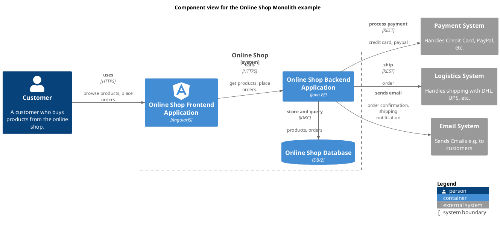

# Component view for the Online Shop Monolith example

## Diagram

## Description
Shows the components of the Online Shop Monolith example and their relations

## Roles
| Person/Role | Description |
|---|---|
| [Customer](../../../../software-development/architecture/example/monolith/customer.md)| A customer who buys products from the online shop. |

## Systems
| System | Description |
|---|---|
| [Email System](../../../../software-development/architecture/example/monolith/email-system.md)| Sends Emails e.g. to customers |
| [Logistics System](../../../../software-development/architecture/example/monolith/logistics-system.md)| Handles shipping with DHL, UPS, etc. |
| [Online Shop](../../../../software-development/architecture/example/monolith/online-shop-system.md)| An online shop system that sells products to customers. |
| [Payment System](../../../../software-development/architecture/example/monolith/payment-system.md)| Handles Credit Card, PayPal, etc. |

## Containers
| Container | Description |
|---|---|
| [Online Shop Backend Application](../../../../software-development/architecture/example/monolith/online-shop-backend.md)|  |
| [Online Shop Database](../../../../software-development/architecture/example/monolith/online-shop-db.md)|  |
| [Online Shop Frontend Application](../../../../software-development/architecture/example/monolith/online-shop-frontend.md)|  |

## Synchronous Requests
| From | Name | To | Technology | Description |
|---|---|---|---|---|
| [Online Shop Frontend Application](../../../../software-development/architecture/example/monolith/online-shop-frontend.md) | calls | [Online Shop Backend Application](../../../../software-development/architecture/example/monolith/online-shop-backend.md) | HTTPS | get products, place orders. |
| [Online Shop Backend Application](../../../../software-development/architecture/example/monolith/online-shop-backend.md) | process payment | [Payment System](../../../../software-development/architecture/example/monolith/payment-system.md) | REST | credit card, paypal |
| [Online Shop Backend Application](../../../../software-development/architecture/example/monolith/online-shop-backend.md) | sends email | [Email System](../../../../software-development/architecture/example/monolith/email-system.md) |  | order confirmation, shipping notification |
| [Online Shop Backend Application](../../../../software-development/architecture/example/monolith/online-shop-backend.md) | ship | [Logistics System](../../../../software-development/architecture/example/monolith/logistics-system.md) | REST | order |
| [Online Shop Backend Application](../../../../software-development/architecture/example/monolith/online-shop-backend.md) | store and query | [Online Shop Database](../../../../software-development/architecture/example/monolith/online-shop-db.md) | JDBC | products, orders |
| [Customer](../../../../software-development/architecture/example/monolith/customer.md) | uses | [Online Shop Frontend Application](../../../../software-development/architecture/example/monolith/online-shop-frontend.md) | HTTPS | browse products, place orders |

## Navigation
[List of views in namespace](./views-in-namespace.md)

[List of all Views](../../../../views.md)

(generated by [Overarch](https://github.com/soulspace-org/overarch) with template docs/views/view.md.cmb)

