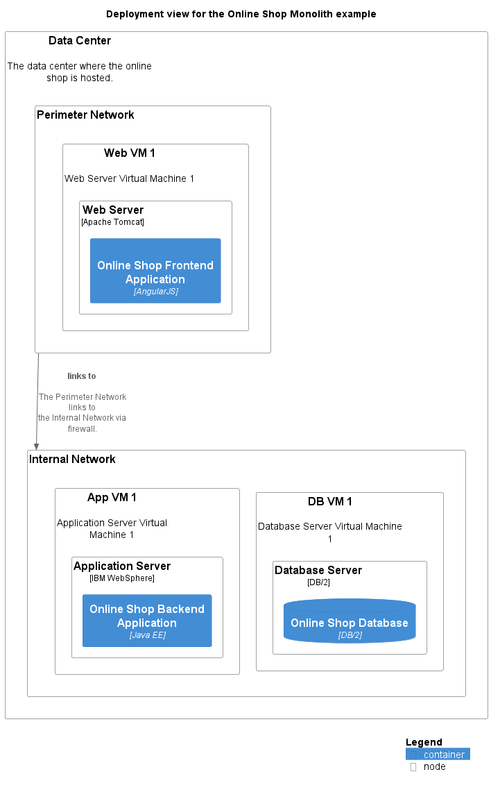

# Deployment view for the Online Shop Monolith example

## Diagram

## Description
Shows the deployment of the Online Shop Monolith example

## Nodes
| Name | Technology | Description |
|---|---|---|
| [App VM 1](../../../../software-development/architecture/example/monolith/app-vm1.md) |  | Application Server Virtual Machine 1 |
| [Application Server](../../../../software-development/architecture/example/monolith/application-server.md) | IBM WebSphere |  |
| [Data Center](../../../../software-development/architecture/example/monolith/data-center.md) |  | The data center where the online shop is hosted. |
| [Database Server](../../../../software-development/architecture/example/monolith/db-server.md) | DB/2 |  |
| [DB VM 1](../../../../software-development/architecture/example/monolith/db-vm1.md) |  | Database Server Virtual Machine 1 |
| [Internal Network](../../../../software-development/architecture/example/monolith/internal-network.md) |  |  |
| [Perimeter Network](../../../../software-development/architecture/example/monolith/perimeter-network.md) |  |  |
| [Web Server](../../../../software-development/architecture/example/monolith/web-server.md) | Apache Tomcat |  |
| [Web VM 1](../../../../software-development/architecture/example/monolith/web-vm1.md) |  | Web Server Virtual Machine 1 |

## Links
| From | Name | To | Technology | Description |
|---|---|---|---|---|
| [Perimeter Network](../../../../software-development/architecture/example/monolith/perimeter-network.md) | links to | [Internal Network](../../../../software-development/architecture/example/monolith/internal-network.md) |  | The Perimeter Network links to the Internal Network via firewall. |

## Navigation
[List of views in namespace](./views-in-namespace.md)
[List of all Views](../../../../views.md)

(generated with docs/views/deployment-view.md.cmb)
