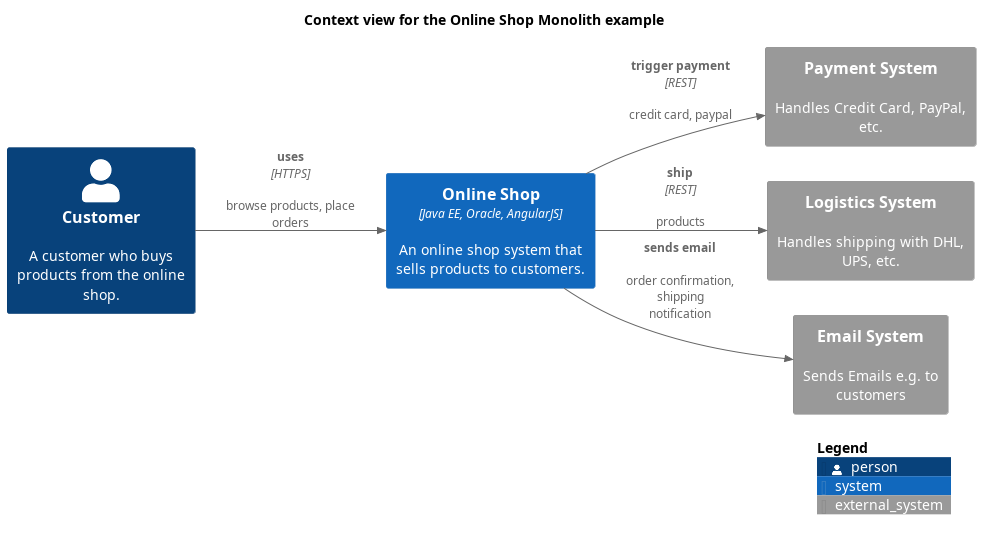

# Email System (System)
## Description
Sends Emails e.g. to customers

## Technology

## Interfaces

### Synchronous Interfaces

#### Provided Services

| From | Name | To | Technology | Description |
|---|---|---|---|---|
| [Online Shop Backend Application](../../../../software-development/architecture/example/monolith/online-shop-backend.md) | sends email | [Email System](../../../../software-development/architecture/example/monolith/email-system.md) |  | order confirmation, shipping notification |
| [Online Shop](../../../../software-development/architecture/example/monolith/online-shop-system.md) | sends email | [Email System](../../../../software-development/architecture/example/monolith/email-system.md) |  | order confirmation, shipping notification |

## System Context View

[Context view for the Online Shop Monolith example](../../../../software-development/architecture/example/monolith/context-view.md)

## Navigation
[List of views in namespace](./views-in-namespace.md)

[List of all Views](../../../../views.md)

(generated with docs/architecture-node.md.cmb)
