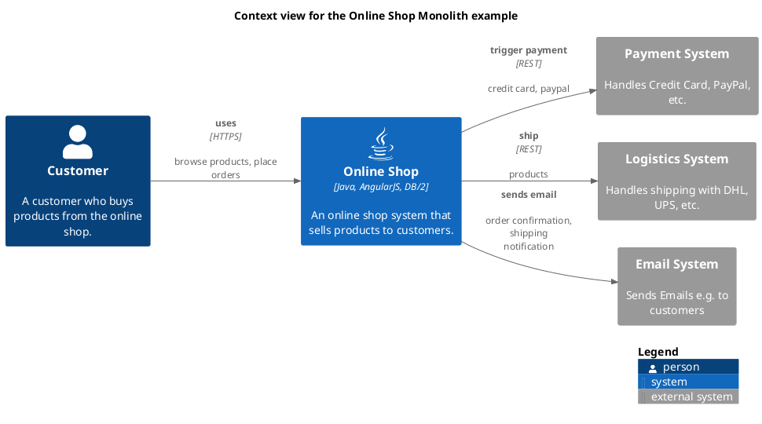

# Logistics System (System)
## Description
Handles shipping with DHL, UPS, etc.

## Incoming Synchronous Requests 
| From | Name | To | Technology | Description |
|---|---|---|---|---|
| [Online Shop Backend Application](../../../../software-development/architecture/example/monolith/online-shop-backend.md) | ship | [Logistics System](../../../../software-development/architecture/example/monolith/logistics-system.md) | order |
| [Online Shop](../../../../software-development/architecture/example/monolith/online-shop-system.md) | ship | [Logistics System](../../../../software-development/architecture/example/monolith/logistics-system.md) | products |

## System Context View

[Context view for the Online Shop Monolith example](../../../../software-development/architecture/example/monolith/context-view.md)

## Navigation
[List of views in namespace](./views-in-namespace.md)

[List of all Views](../../../../views.md)

(generated by [Overarch](https://github.com/soulspace-org/overarch) with template docs/node.md.cmb)
