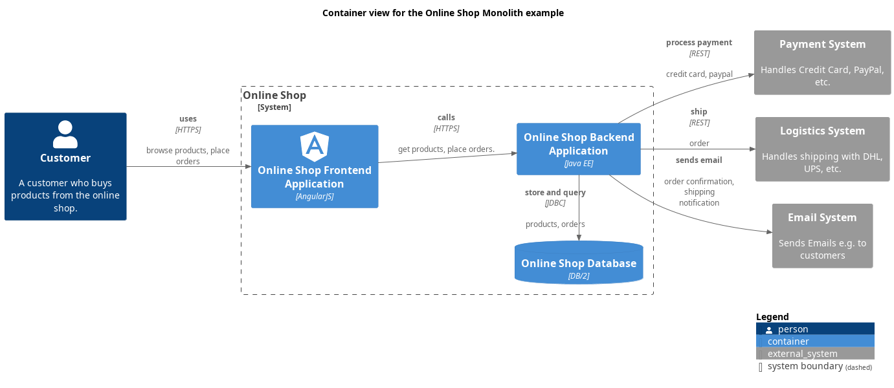

# Online Shop Database (Container)
## Description

## Parent
[Online Shop](../../../../software-development/architecture/example/monolith/online-shop-system.md)

## Technology
DB/2
## Incoming Synchronous Requests 
| From | Name | To | Technology | Description |
|---|---|---|---|---|
| [Online Shop Backend Application](../../../../software-development/architecture/example/monolith/online-shop-backend.md) | store and query | [Online Shop Database](../../../../software-development/architecture/example/monolith/online-shop-db.md) | JDBC | products, orders |
## Deployed to
| Node | Description |
|---|---|
| [Database Server](../../../../software-development/architecture/example/monolith/db-server.md)|  |

## Container View

[Container view for the Online Shop Monolith example](../../../../software-development/architecture/example/monolith/container-view.md)

## Navigation
[List of views in namespace](./views-in-namespace.md)

[List of all Views](../../../../views.md)

(generated by [Overarch](https://github.com/soulspace-org/overarch) with template docs/node.md.cmb)
