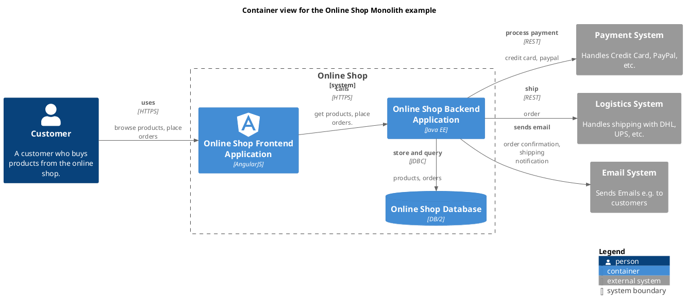

# Online Shop Frontend Application (Container)
## Description

## Technology
AngularJS

## Parent
[Online Shop](../../../../software-development/architecture/example/monolith/online-shop-system.md)

## Interfaces

### Synchronous Interfaces

#### Provided Services

| From | Name | To | Technology | Description |
|---|---|---|---|---|
| [Customer](../../../../software-development/architecture/example/monolith/customer.md) | uses | [Online Shop Frontend Application](../../../../software-development/architecture/example/monolith/online-shop-frontend.md) | HTTPS | browse products, place orders |

#### Used Services

| From | Name | To | Technology | Description |
|---|---|---|---|---|
| [Online Shop Frontend Application](../../../../software-development/architecture/example/monolith/online-shop-frontend.md) | calls | [Online Shop Backend Application](../../../../software-development/architecture/example/monolith/online-shop-backend.md) | HTTPS | get products, place orders. |

## Container View

[Container view for the Online Shop Monolith example](../../../../software-development/architecture/example/monolith/container-view.md)

## Navigation
[List of views in namespace](./views-in-namespace.md)

[List of all Views](../../../../views.md)

(generated with docs/architecture-node.md.cmb)
