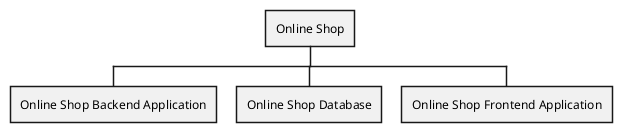

# System Structure View for the Online Shop Monolith example

## Diagram

## Description
Shows the structure of the Online Shop Monolith example

## Systems
| System | Description |
|---|---|
| [Online Shop](../../../../software-development/architecture/example/monolith/online-shop-system.md)| An online shop system that sells products to customers. |

## Navigation
[List of views in namespace](./views-in-namespace.md)

[List of all Views](../../../../views.md)

(generated by [Overarch](https://github.com/soulspace-org/overarch) with template docs/view.md.cmb)

