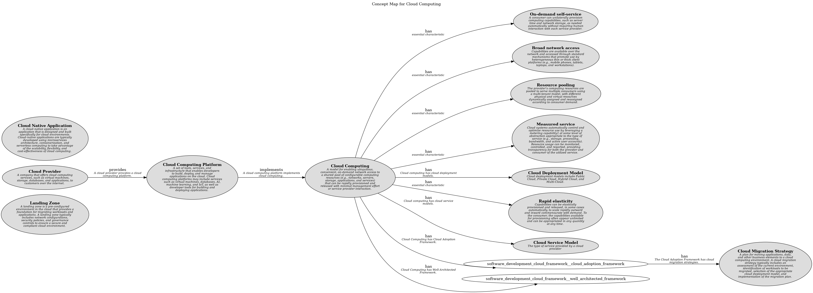

# Cloud Computing Platform (Concept)
## Description
A  set of tools, services, and infrastructure that enables developers
          to build, deploy, and manage applications on the cloud. Cloud computing platforms may include
          services such as virtual machines, databases, AI, machine learning, and IoT, as well as developer
          tools for building and deploying applications.

## Subordinates
| Name | Description |
|---|---|
| [Alibaba Cloud](../../software-development/cloud/alibaba-cloud.md) | A cloud computing platform and service created by Alibaba. Alibaba Cloud offers a wide range of cloud services, including virtual machines, databases, AI, machine learning, and IoT, as well as developer tools and services for building, deploying, and managing applications on the cloud. |
| [Amazon Web Services (AWS)](../../software-development/cloud/aws.md) | A cloud computing platform and service created by Amazon. AWS offers a wide range of cloud services, including virtual machines, databases, AI, machine learning, and IoT, as well as developer tools and services for building, deploying, and managing applications on the cloud. |
| [Azure](../../software-development/cloud/azure.md) | A cloud computing platform and service created by Microsoft. Azure offers a wide range of cloud services, including virtual machines, databases, AI, machine learning, and IoT, as well as developer tools and services for building, deploying, and managing applications on the cloud. |
| [Google Cloud](../../software-development/cloud/google-cloud.md) | A cloud computing platform and service created by Google. Google Cloud offers a wide range of cloud services, including virtual machines, databases, AI, machine learning, and IoT, as well as developer tools and services for building, deploying, and managing applications on the cloud. |
| [IBM Cloud](../../software-development/cloud/ibm-cloud.md) | A cloud computing platform and service created by IBM. IBM Cloud offers a wide range of cloud services, including virtual machines, databases, AI, machine learning, and IoT, as well as developer tools and services for building, deploying, and managing applications on the cloud. |
| [Oracle Cloud](../../software-development/cloud/oracle-cloud.md) | A cloud computing platform and service created by Oracle. Oracle Cloud offers a wide range of cloud services, including virtual machines, databases, AI, machine learning, and IoT, as well as developer tools and services for building, deploying, and managing applications on the cloud. |
| [Tencent Cloud](../../software-development/cloud/tencent-cloud.md) | A cloud computing platform and service created by Tencent. Tencent Cloud offers a wide range of cloud services, including virtual machines, databases, AI, machine learning, and IoT, as well as developer tools and services for building, deploying, and managing applications on the cloud. |

## Relation from
| From | Name | To | Description |
|---|---|---|---|
| [Cloud Provider](../../software-development/cloud/cloud-provider.md) | provides | [Cloud Computing Platform](../../software-development/cloud/cloud-computing-platform.md) | A cloud provider provides a cloud computing platform. |

## Related to
| From | Name | To | Description |
|---|---|---|---|
| [Cloud Computing Platform](../../software-development/cloud/cloud-computing-platform.md) | implements | [Cloud Computing](../../software-development/cloud/cloud-computing.md) | A cloud computing platform implements cloud computing. |

## Concept Map

[Cloud Computing Concept Map](../../software-development/cloud/concept-view.md)

### Tags
cloud, platform

## Navigation
[List of views in namespace](./views-in-namespace.md)

[List of all Views](../../views.md)

(generated with docs/concept.md.cmb)
