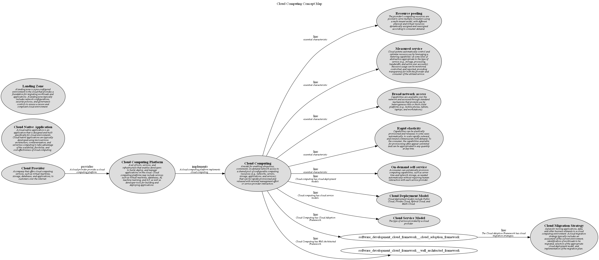

# Cloud Computing Concept Map

## Diagram

## Description
Shows the concepts related to Cloud Computing and their relationships.

## Concepts
| Concept | Description |
|---|---|
| [Alibaba](../../software-development/cloud/provider/alibaba.md)| Alibaba Cloud, also known as Aliyun, is a Chinese cloud computing company, a subsidiary of Alibaba Group. Alibaba Cloud provides a comprehensive suite of global cloud computing services to power both international customers’ online businesses and Alibaba Group’s own e-commerce ecosystem. |
| [Alibaba Cloud](../../software-development/cloud/alibaba-cloud.md)| A cloud computing platform and service created by Alibaba. Alibaba Cloud offers a wide range of cloud services, including virtual machines, databases, AI, machine learning, and IoT, as well as developer tools and services for building, deploying, and managing applications on the cloud. |
| [Amazon](../../software-development/cloud/provider/amazon.md)| Amazon Web Services (AWS) is a subsidiary of Amazon providing on-demand cloud computing platforms and APIs to individuals, companies, and governments, on a metered pay-as-you-go basis. |
| [Amazon Web Services (AWS)](../../software-development/cloud/aws.md)| A cloud computing platform and service created by Amazon. AWS offers a wide range of cloud services, including virtual machines, databases, AI, machine learning, and IoT, as well as developer tools and services for building, deploying, and managing applications on the cloud. |
| [Azure](../../software-development/cloud/azure.md)| A cloud computing platform and service created by Microsoft. Azure offers a wide range of cloud services, including virtual machines, databases, AI, machine learning, and IoT, as well as developer tools and services for building, deploying, and managing applications on the cloud. |
| [Baidu](../../software-development/cloud/provider/baidu.md)| Baidu Cloud is a cloud computing service provided by Baidu, a Chinese multinational technology company specializing in Internet-related services and products. Baidu Cloud offers a range of cloud services, including computing, storage, databases, and AI, to help businesses build and deploy applications in the cloud. |
| [Broad network access](../../software-development/cloud/broad-network-access.md)| Capabilities are available over the network and accessed through standard mechanisms that promote use by heterogeneous thin or thick client platforms (e.g., mobile phones, tablets, laptops, and workstations). |
| [Cloud Adoption Framework](../../software-development/cloud/cloud-adoption-framework.md)| A set of best practices, guidelines, and tools for organizations to plan, implement, and manage their cloud adoption journey. The framework provides a structured approach to cloud adoption, including assessment, planning, migration, and optimization phases. |
| [Cloud Computing](../../software-development/cloud/cloud-computing.md)| A model for enabling ubiquitous, convenient, on-demand network access to a shared pool of configurable computing resources (e.g., networks, servers, storage, applications, and services) that can be rapidly provisioned and released with minimal management effort or service provider interaction. |
| [Cloud Computing Platform](../../software-development/cloud/cloud-computing-platform.md)| A  set of tools, services, and infrastructure that enables developers to build, deploy, and manage applications on the cloud. Cloud computing platforms may include services such as virtual machines, databases, AI, machine learning, and IoT, as well as developer tools for building and deploying applications. |
| [Cloud Deployment Model](../../software-development/cloud/cloud-deployment-model.md)| Cloud deployment models include Public Cloud, Private Cloud, Hybrid Cloud, and Multi-Cloud. |
| [Cloud Migration Assessment](../../software-development/cloud/cloud-migration-assessment.md)| Cloud migration assessment is the process of evaluating an organization's current environment, workloads, and applications to determine their suitability for migration to the cloud. A cloud migration assessment typically includes an inventory of existing assets, an analysis of dependencies and interdependencies, and a risk assessment to identify potential challenges and opportunities. |
| [Cloud Migration Execution](../../software-development/cloud/cloud-migration-execution.md)| Cloud migration execution is the process of implementing a cloud migration plan and moving applications, data, and other business elements to a cloud computing environment. Cloud migration execution typically involves provisioning cloud resources, migrating data, testing applications, and monitoring performance to ensure a successful migration. |
| [Cloud Migration Optimization](../../software-development/cloud/cloud-migration-optimization.md)| Cloud migration optimization is the process of fine-tuning applications, data, and other business elements in a cloud computing environment to improve performance, reduce costs, and maximize the benefits of cloud migration. Cloud migration optimization typically involves monitoring performance, analyzing usage patterns, and making adjustments to optimize resource utilization and efficiency. |
| [Cloud Migration Plan](../../software-development/cloud/cloud-migration-plan.md)| Cloud migration plan is a detailed roadmap for moving applications, data, and other business elements to a cloud computing environment. A cloud migration plan typically includes a timeline, budget, resource allocation, risk management strategy, and communication plan to ensure a successful migration. |
| [Cloud Migration Strategy](../../software-development/cloud/cloud-migration-strategy.md)| A plan for moving applications, data, and other business elements to a cloud computing environment. A cloud migration strategy typically includes an assessment of the current environment, identification of workloads to be migrated, selection of the appropriate cloud deployment model, and implementation of the migration plan. |
| [Cloud Migration Validation](../../software-development/cloud/cloud-migration-validation.md)| Cloud migration validation is the process of verifying that applications, data, and other business elements have been successfully migrated to a cloud computing environment and are functioning as expected. Cloud migration validation typically involves testing applications, monitoring performance, and validating data integrity to ensure a successful migration. |
| [Cloud Native Application](../../software-development/cloud/cloud-native-application.md)| A cloud-native application is an application that is designed and built specifically for cloud environments. Cloud-native applications are typically developed using microservices architecture, containerization, and serverless computing to take advantage of the scalability, flexibility, and cost-effectiveness of cloud computing. |
| [Cloud Provider](../../software-development/cloud/cloud-provider.md)| A company that offers cloud computing services, such as virtual machines, storage, databases, and applications, to customers over the internet. |
| [Cloud Service Model](../../software-development/cloud/cloud-service-model.md)| The type of service provided by a cloud provider |
| [Container as a Service (CaaS)](../../software-development/cloud/service-model/caas.md)| Allows users to manage and deploy containers, which are lightweight, standalone, executable packages that include everything needed to run an application, including the code, runtime, system tools, libraries, and settings. |
| [Function as a Service (FaaS)](../../software-development/cloud/service-model/faas.md)| Allows users to run pieces of code in response to events or triggers in a serverless deployment. |
| [Google](../../software-development/cloud/provider/google.md)| Google Cloud Platform, offered by Google, is a suite of cloud computing services that runs on the same infrastructure that Google uses internally for its end-user products, such as Google Search, Gmail, file storage, and YouTube. |
| [Google Cloud](../../software-development/cloud/google-cloud.md)| A cloud computing platform and service created by Google. Google Cloud offers a wide range of cloud services, including virtual machines, databases, AI, machine learning, and IoT, as well as developer tools and services for building, deploying, and managing applications on the cloud. |
| [Huawei](../../software-development/cloud/provider/huawei.md)| Huawei Cloud is a cloud computing service provided by Huawei, a Chinese multinational technology company. Huawei Cloud offers a wide range of cloud services, including computing, storage, databases, security, and AI, to help businesses build and deploy applications in the cloud. |
| [Hybrid Cloud](../../software-development/cloud/deployment-model/hybrid-cloud.md)| A cloud computing environment that combines public cloud services with private cloud services. |
| [IBM](../../software-development/cloud/provider/ibm.md)| IBM Cloud is a suite of cloud computing services from IBM that offers both platform as a service (PaaS) and infrastructure as a service (IaaS) options. |
| [IBM Cloud](../../software-development/cloud/ibm-cloud.md)| A cloud computing platform and service created by IBM. IBM Cloud offers a wide range of cloud services, including virtual machines, databases, AI, machine learning, and IoT, as well as developer tools and services for building, deploying, and managing applications on the cloud. |
| [Infrastructure as a Service (IaaS)](../../software-development/cloud/service-model/iaas.md)| Provides virtualized network and computing resources over the internet |
| [Landing Zone](../../software-development/cloud/landing-zone.md)| A landing zone is a pre-configured environment in the cloud that provides a foundation for migrating workloads and applications. A landing zone typically includes network configurations, security policies, and governance controls to ensure a secure and compliant cloud environment. |
| [Lift and Shift](../../software-development/cloud/migration/lift-and-shift.md)| Lift and shift, also known as 'rehost,' involves moving an application from an on-premises environment to the cloud without making any changes to the application itself. This approach is often used for applications that are not cloud-native and do not take advantage of cloud-specific features. |
| [Measured service](../../software-development/cloud/measured-service.md)| Cloud systems automatically control and optimize resource use by leveraging a metering capability1 at some level of abstraction appropriate to the type of service (e.g., storage, processing, bandwidth, and active user accounts). Resource usage can be monitored, controlled, and reported, providing transparency for both the provider and consumer of the utilized service. |
| [Microsoft](../../software-development/cloud/provider/microsoft.md)| Microsoft Azure, commonly referred to as Azure, is a cloud computing service created by Microsoft for building, testing, deploying, and managing applications and services through Microsoft-managed data centers. |
| [Multi-Cloud](../../software-development/cloud/deployment-model/multi-cloud.md)| A cloud computing strategy that involves using multiple cloud services from different providers. |
| [On Premises](../../software-development/cloud/deployment-model/on-premises.md)| Refers to the deployment of software or services on a company's own hardware or servers, rather than on a cloud provider's infrastructure. |
| [On-demand self-service](../../software-development/cloud/on-demand-self-service.md)| A consumer can unilaterally provision computing capabilities, such as server time and network storage, as needed automatically without requiring human interaction with each service provider. |
| [Oracle](../../software-development/cloud/provider/oracle.md)| Oracle Cloud is a cloud computing service offered by Oracle Corporation providing servers, storage, network, applications, and services through a global network of Oracle Corporation managed data centers. |
| [Oracle Cloud](../../software-development/cloud/oracle-cloud.md)| A cloud computing platform and service created by Oracle. Oracle Cloud offers a wide range of cloud services, including virtual machines, databases, AI, machine learning, and IoT, as well as developer tools and services for building, deploying, and managing applications on the cloud. |
| [Platform as a Service (PaaS)](../../software-development/cloud/service-model/paas.md)| Provides a platform of services allowing customers to develop, run, and manage applications without the complexity managing virtual machines |
| [Private Cloud](../../software-development/cloud/deployment-model/private-cloud.md)| Type of cloud computing in which resources are dedicated to a single organization or user group. Private cloud services may be hosted on-premises or by a third-party service provider. |
| [Public Cloud](../../software-development/cloud/deployment-model/public-cloud.md)| Type of cloud computing in which a service provider makes resources such as virtual machines, applications, or storage available to the general public over the internet. Public cloud services may be free or offered on a pay-per-usage model. |
| [Rapid elasticity](../../software-development/cloud/rapid-elasticity.md)| Capabilities can be elastically provisioned and released, in some cases automatically, to scale rapidly outward and inward commensurate with demand. To the consumer, the capabilities available for provisioning often appear unlimited and can be appropriated in any quantity at any time. |
| [Rearchitect](../../software-development/cloud/migration/rearchitect.md)| Rearchitecting, also known as 'rebuild', involves redesigning an application to take advantage of cloud-native features and capabilities. This approach is used to optimize an application for the cloud and improve its performance, scalability, and reliability. |
| [Rebuild](../../software-development/cloud/migration/rebuild.md)| Rebuilding, also known as 'rearchitect', involves redeveloping an application from scratch using cloud-native technologies and services. This approach is used to create a new, cloud-native application that is optimized for the cloud and takes advantage of its features and capabilities. |
| [Red Hat](../../software-development/cloud/provider/redhat.md)| Red Hat OpenShift is a cloud computing service provided by Red Hat, an American multinational software company. Red Hat OpenShift offers a range of cloud services, including computing, storage, databases, security, and AI, to help businesses build and deploy applications in the cloud. |
| [Refactor](../../software-development/cloud/migration/refactor.md)| Refactoring, also known as 'replatform,' involves making minor changes to an application before migrating it to the cloud. This approach is used to optimize an application for the cloud without completely redesigning it. |
| [Rehost](../../software-development/cloud/migration/rehost.md)| Rehosting, also known as 'lift and shift,' involves moving an application from an on-premises environment to the cloud without making any changes to the application itself. This approach is often used for applications that are not cloud-native and do not take advantage of cloud-specific features. |
| [Relocate](../../software-development/cloud/migration/relocate.md)| Relocating an application to a different cloud provider or region. This approach is used to improve performance, reduce costs, or comply with regulatory requirements by moving an application to a different cloud environment. |
| [Replace](../../software-development/cloud/migration/replace.md)| Replacing an application with a commercial off-the-shelf (COTS) software or a cloud-based service. This approach is used to modernize an application and take advantage of new features and capabilities offered by third-party solutions. |
| [Replatform](../../software-development/cloud/migration/replatform.md)| Replatforming, also known as 'lift, tinker, and shift,' involves making minor changes to an application before migrating it to the cloud. This approach is used to optimize an application for the cloud without completely redesigning it. |
| [Repurchase](../../software-development/cloud/migration/repurchase.md)| Repurchasing an application by moving from an on-premises deployment to a cloud-based service or vice versa. This approach is used to change the licensing model, reduce costs, or take advantage of new features and capabilities offered by cloud-based services. |
| [Resource pooling](../../software-development/cloud/resource-pooling.md)| The provider's computing resources are pooled to serve multiple consumers using a multi-tenant model, with different physical and virtual resources dynamically assigned and reassigned according to consumer demand. |
| [Retain](../../software-development/cloud/migration/retain.md)| Retaining involves keeping an application in its current state and not migrating it to the cloud. This approach is typically used for applications that are not suitable for the cloud due to technical, regulatory, or business constraints. |
| [Retire](../../software-development/cloud/migration/retire.md)| Retiring involves decommissioning an application that is no longer needed or relevant. This approach is used to reduce the complexity and cost of an organization's application portfolio. |
| [SAP](../../software-development/cloud/provider/sap.md)| SAP Cloud Platform is a cloud computing service provided by SAP, a German multinational software corporation. SAP Cloud Platform offers a range of cloud services, including computing, storage, databases, security, and AI, to help businesses build and deploy applications in the cloud. |
| [Software as a Service (SaaS)](../../software-development/cloud/service-model/saas.md)| A software distribution model in which a third-party provider hosts applications in the cloud and makes them available to customers over the Internet |
| [Tencent](../../software-development/cloud/provider/tencent.md)| Tencent Cloud is a cloud computing service provided by Tencent, a Chinese multinational conglomerate holding company. Tencent Cloud provides a wide range of cloud services, including computing, storage, databases, security, and networking, to help businesses build and deploy applications in the cloud. |
| [Tencent Cloud](../../software-development/cloud/tencent-cloud.md)| A cloud computing platform and service created by Tencent. Tencent Cloud offers a wide range of cloud services, including virtual machines, databases, AI, machine learning, and IoT, as well as developer tools and services for building, deploying, and managing applications on the cloud. |
| [VMware](../../software-development/cloud/provider/vmware.md)| VMware Cloud is a cloud computing service provided by VMware, an American cloud computing and virtualization technology company. VMware Cloud offers a range of cloud services, including computing, storage, databases, security, and networking, to help businesses build and deploy applications in the cloud. |
| [Well-Architected Framework](../../software-development/cloud/well-architected-framework.md)| A set of best practices and guidelines for designing, building, and optimizing cloud-based applications. The framework provides a structured approach to evaluating the architecture of cloud applications across five pillars: operational excellence, security, reliability, performance efficiency, and cost optimization. |

## Generalizations
| From | Name | To | Description |
|---|---|---|---|
| [Retain](../../software-development/cloud/migration/retain.md) | is a | [Cloud Migration Strategy](../../software-development/cloud/cloud-migration-strategy.md) |  |
| [Replatform](../../software-development/cloud/migration/replatform.md) | is a | [Cloud Migration Strategy](../../software-development/cloud/cloud-migration-strategy.md) |  |
| [Alibaba](../../software-development/cloud/provider/alibaba.md) | is a | [Cloud Provider](../../software-development/cloud/cloud-provider.md) | Alibaba is a cloud provider. |
| [Rearchitect](../../software-development/cloud/migration/rearchitect.md) | is a | [Cloud Migration Strategy](../../software-development/cloud/cloud-migration-strategy.md) |  |
| [Red Hat](../../software-development/cloud/provider/redhat.md) | is a | [Cloud Provider](../../software-development/cloud/cloud-provider.md) | Red Hat is a cloud provider. |
| [Repurchase](../../software-development/cloud/migration/repurchase.md) | is a | [Cloud Migration Strategy](../../software-development/cloud/cloud-migration-strategy.md) |  |
| [Alibaba Cloud](../../software-development/cloud/alibaba-cloud.md) | is a | [Cloud Computing Platform](../../software-development/cloud/cloud-computing-platform.md) | Alibaba Cloud is a cloud computing platform. |
| [IBM Cloud](../../software-development/cloud/ibm-cloud.md) | is a | [Cloud Computing Platform](../../software-development/cloud/cloud-computing-platform.md) | IBM Cloud is a cloud computing platform. |
| [Retire](../../software-development/cloud/migration/retire.md) | is a | [Cloud Migration Strategy](../../software-development/cloud/cloud-migration-strategy.md) |  |
| [Rehost](../../software-development/cloud/migration/rehost.md) | is a | [Cloud Migration Strategy](../../software-development/cloud/cloud-migration-strategy.md) |  |
| [Tencent Cloud](../../software-development/cloud/tencent-cloud.md) | is a | [Cloud Computing Platform](../../software-development/cloud/cloud-computing-platform.md) | Tencent Cloud is a cloud computing platform. |
| [Microsoft](../../software-development/cloud/provider/microsoft.md) | is a | [Cloud Provider](../../software-development/cloud/cloud-provider.md) | Microsoft is a cloud provider. |
| [Amazon](../../software-development/cloud/provider/amazon.md) | is a | [Cloud Provider](../../software-development/cloud/cloud-provider.md) | Amazon is a cloud provider. |
| [SAP](../../software-development/cloud/provider/sap.md) | is a | [Cloud Provider](../../software-development/cloud/cloud-provider.md) | SAP is a cloud provider. |
| [Replace](../../software-development/cloud/migration/replace.md) | is a | [Cloud Migration Strategy](../../software-development/cloud/cloud-migration-strategy.md) |  |
| [Google Cloud](../../software-development/cloud/google-cloud.md) | is a | [Cloud Computing Platform](../../software-development/cloud/cloud-computing-platform.md) | Google Cloud is a cloud computing platform. |
| [Infrastructure as a Service (IaaS)](../../software-development/cloud/service-model/iaas.md) | is a | [Cloud Service Model](../../software-development/cloud/cloud-service-model.md) | IaaS is a cloud service model. |
| [Google](../../software-development/cloud/provider/google.md) | is a | [Cloud Provider](../../software-development/cloud/cloud-provider.md) | Google is a cloud provider. |
| [Relocate](../../software-development/cloud/migration/relocate.md) | is a | [Cloud Migration Strategy](../../software-development/cloud/cloud-migration-strategy.md) |  |
| [Amazon Web Services (AWS)](../../software-development/cloud/aws.md) | is a | [Cloud Computing Platform](../../software-development/cloud/cloud-computing-platform.md) | AWS is a cloud computing platform. |
| [Function as a Service (FaaS)](../../software-development/cloud/service-model/faas.md) | is a | [Cloud Service Model](../../software-development/cloud/cloud-service-model.md) | FaaS is a cloud service model. |
| [Oracle](../../software-development/cloud/provider/oracle.md) | is a | [Cloud Provider](../../software-development/cloud/cloud-provider.md) | Oracle is a cloud provider. |
| [IBM](../../software-development/cloud/provider/ibm.md) | is a | [Cloud Provider](../../software-development/cloud/cloud-provider.md) | IBM is a cloud provider. |
| [Software as a Service (SaaS)](../../software-development/cloud/service-model/saas.md) | is a | [Cloud Service Model](../../software-development/cloud/cloud-service-model.md) | SaaS is a cloud service model. |
| [Oracle Cloud](../../software-development/cloud/oracle-cloud.md) | is a | [Cloud Computing Platform](../../software-development/cloud/cloud-computing-platform.md) | Oracle Cloud is a cloud computing platform. |
| [Platform as a Service (PaaS)](../../software-development/cloud/service-model/paas.md) | is a | [Cloud Service Model](../../software-development/cloud/cloud-service-model.md) | PaaS is a cloud service model. |
| [Huawei](../../software-development/cloud/provider/huawei.md) | is a | [Cloud Provider](../../software-development/cloud/cloud-provider.md) | Huawei is a cloud provider. |
| [Hybrid Cloud](../../software-development/cloud/deployment-model/hybrid-cloud.md) | is a | [Cloud Deployment Model](../../software-development/cloud/cloud-deployment-model.md) | Hybrid Cloud is a cloud deployment model. |
| [VMware](../../software-development/cloud/provider/vmware.md) | is a | [Cloud Provider](../../software-development/cloud/cloud-provider.md) | VMware is a cloud provider. |
| [Baidu](../../software-development/cloud/provider/baidu.md) | is a | [Cloud Provider](../../software-development/cloud/cloud-provider.md) | Baidu is a cloud provider. |
| [Private Cloud](../../software-development/cloud/deployment-model/private-cloud.md) | is a | [Cloud Deployment Model](../../software-development/cloud/cloud-deployment-model.md) | Private Cloud is a cloud deployment model. |
| [Multi-Cloud](../../software-development/cloud/deployment-model/multi-cloud.md) | is a | [Cloud Deployment Model](../../software-development/cloud/cloud-deployment-model.md) | Multi-Cloud is a cloud deployment model. |
| [Tencent](../../software-development/cloud/provider/tencent.md) | is a | [Cloud Provider](../../software-development/cloud/cloud-provider.md) | Tencent is a cloud provider. |
| [Container as a Service (CaaS)](../../software-development/cloud/service-model/caas.md) | is a | [Cloud Service Model](../../software-development/cloud/cloud-service-model.md) | CaaS is a cloud service model. |
| [Public Cloud](../../software-development/cloud/deployment-model/public-cloud.md) | is a | [Cloud Deployment Model](../../software-development/cloud/cloud-deployment-model.md) | Public Cloud is a cloud deployment model. |
| [Azure](../../software-development/cloud/azure.md) | is a | [Cloud Computing Platform](../../software-development/cloud/cloud-computing-platform.md) | Azure is a cloud computing platform. |

## Features
| From | Name | To | Description |
|---|---|---|---|
| [Cloud Computing](../../software-development/cloud/cloud-computing.md) | has | [Rapid elasticity](../../software-development/cloud/rapid-elasticity.md) | essential characteristic |
| [Cloud Computing](../../software-development/cloud/cloud-computing.md) | has | [Well-Architected Framework](../../software-development/cloud/well-architected-framework.md) | Cloud Computing has Well-Architected Framework. |
| [Cloud Computing](../../software-development/cloud/cloud-computing.md) | has | [Cloud Service Model](../../software-development/cloud/cloud-service-model.md) | Cloud computing has cloud service models. |
| [Cloud Computing](../../software-development/cloud/cloud-computing.md) | has | [On-demand self-service](../../software-development/cloud/on-demand-self-service.md) | essential characteristic |
| [Cloud Computing](../../software-development/cloud/cloud-computing.md) | has | [Cloud Adoption Framework](../../software-development/cloud/cloud-adoption-framework.md) | Cloud Computing has Cloud Adoption Framework. |
| [Cloud Adoption Framework](../../software-development/cloud/cloud-adoption-framework.md) | has | [Cloud Migration Strategy](../../software-development/cloud/cloud-migration-strategy.md) | The Cloud Adoption Framework has cloud migration strategies. |
| [Cloud Computing](../../software-development/cloud/cloud-computing.md) | has | [Measured service](../../software-development/cloud/measured-service.md) | essential characteristic |
| [Cloud Computing](../../software-development/cloud/cloud-computing.md) | has | [Broad network access](../../software-development/cloud/broad-network-access.md) | essential characteristic |
| [Cloud Computing](../../software-development/cloud/cloud-computing.md) | has | [Resource pooling](../../software-development/cloud/resource-pooling.md) | essential characteristic |
| [Cloud Computing](../../software-development/cloud/cloud-computing.md) | has | [Cloud Deployment Model](../../software-development/cloud/cloud-deployment-model.md) | Cloud computing has cloud deployment models. |

## Other Relationships
| From | Name | To | Description |
|---|---|---|---|
| [Cloud Computing Platform](../../software-development/cloud/cloud-computing-platform.md) | implements | [Cloud Computing](../../software-development/cloud/cloud-computing.md) | A cloud computing platform implements cloud computing. |
| [Cloud Provider](../../software-development/cloud/cloud-provider.md) | provides | [Cloud Computing Platform](../../software-development/cloud/cloud-computing-platform.md) | A cloud provider provides a cloud computing platform. |
| [Lift and Shift](../../software-development/cloud/migration/lift-and-shift.md) | synonym of | [Rehost](../../software-development/cloud/migration/rehost.md) |  |
| [Refactor](../../software-development/cloud/migration/refactor.md) | synonym of | [Replatform](../../software-development/cloud/migration/replatform.md) |  |
| [Rebuild](../../software-development/cloud/migration/rebuild.md) | synonym of | [Rearchitect](../../software-development/cloud/migration/rearchitect.md) |  |

## Navigation
[List of views in namespace](./views-in-namespace.md)

[List of all Views](../../views.md)

(generated by [Overarch](https://github.com/soulspace-org/overarch) with template docs/views/view.md.cmb)

