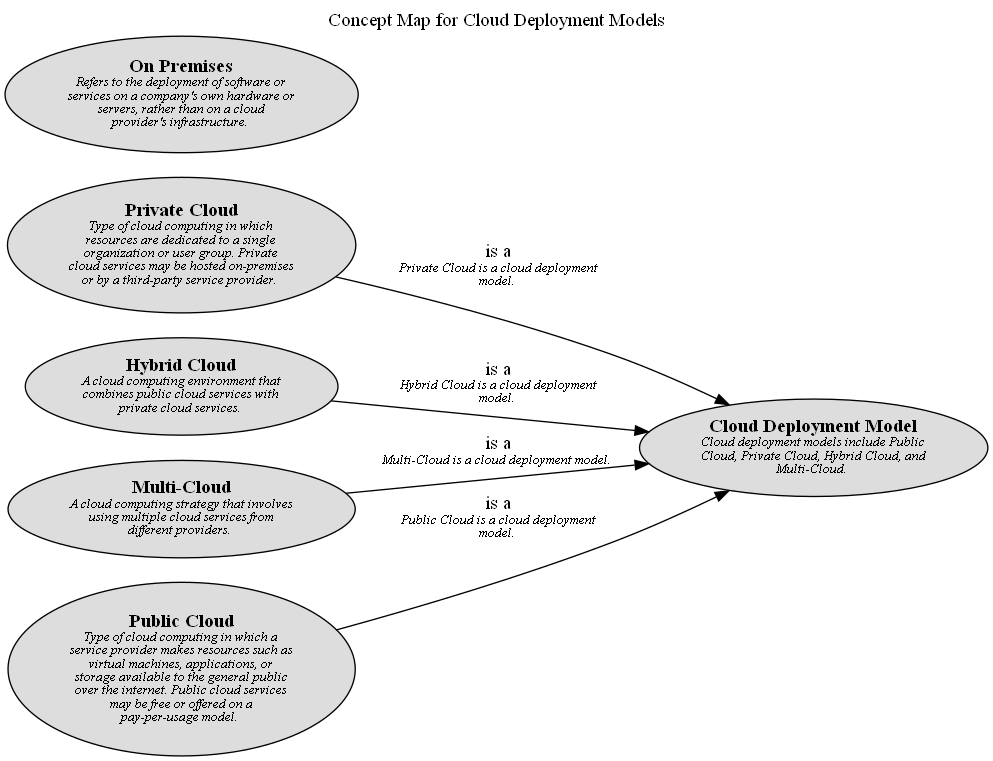

# On Premises (Concept)
## Description
Refers to the deployment of software or services on a company's own
          hardware or servers, rather than on a cloud provider's infrastructure.

## Tags
cloud, model, deployment

## Concept Map

[Concept Map for Cloud Deployment Models](../../../software-development/cloud/deployment-model/concept-view.md)

## Navigation
[List of views in namespace](./views-in-namespace.md)

[List of all Views](../../../views.md)

(generated by [Overarch](https://github.com/soulspace-org/overarch) with template docs/node.md.cmb)
