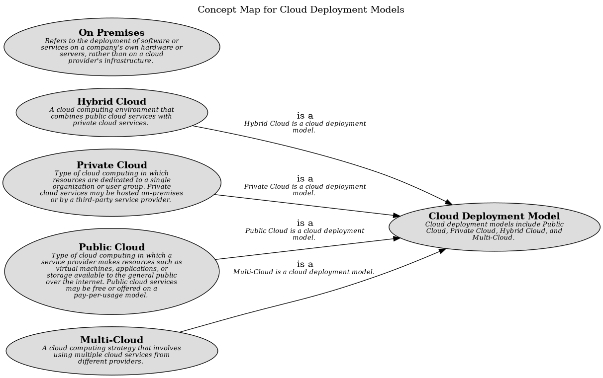

# Public Cloud (Concept)
## Description
Type of cloud computing in which a service provider makes resources
          such as virtual machines, applications, or storage available to the general public over
          the internet. Public cloud services may be free or offered on a pay-per-usage model.

## Tags
cloud, model, deployment
## Superordinates
| Concept | Description |
|---|---|
| [Cloud Deployment Model](../../../software-development/cloud/cloud-deployment-model.md)| Cloud deployment models include Public Cloud, Private Cloud, Hybrid Cloud, and Multi-Cloud. |

## Concept Map

[Concept Map for Cloud Deployment Models](../../../software-development/cloud/deployment-model/concept-view.md)

## Navigation
[List of views in namespace](./views-in-namespace.md)

[List of all Views](../../../views.md)

(generated by [Overarch](https://github.com/soulspace-org/overarch) with template docs/node.md.cmb)
