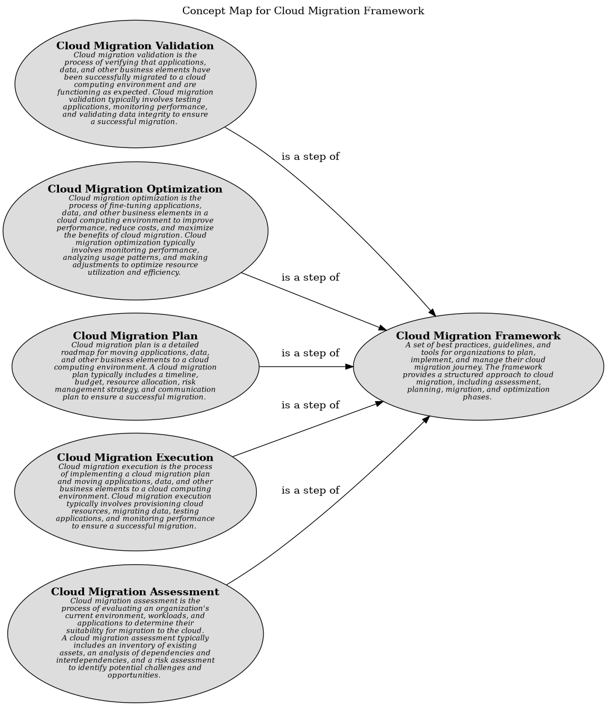

# Concept Map for Cloud Migration Framework

## Diagram

## Description
Shows the concepts related to the cloud migration framework and their relationships.

## Concepts
| Concept | Description |
|---|---|
| [Cloud Migration Assessment](../../../../software-development/cloud/framework/cmf/cloud-migration-assessment.md)| Cloud migration assessment is the process of evaluating an organization's current environment, workloads, and applications to determine their suitability for migration to the cloud. A cloud migration assessment typically includes an inventory of existing assets, an analysis of dependencies and interdependencies, and a risk assessment to identify potential challenges and opportunities. |
| [Cloud Migration Execution](../../../../software-development/cloud/framework/cmf/cloud-migration-execution.md)| Cloud migration execution is the process of implementing a cloud migration plan and moving applications, data, and other business elements to a cloud computing environment. Cloud migration execution typically involves provisioning cloud resources, migrating data, testing applications, and monitoring performance to ensure a successful migration. |
| [Cloud Migration Framework](../../../../software-development/cloud/framework/cloud-migration-framework.md)| A set of best practices, guidelines, and tools for organizations to plan, implement, and manage their cloud migration journey. The framework provides a structured approach to cloud migration, including assessment, planning, migration, and optimization phases. |
| [Cloud Migration Optimization](../../../../software-development/cloud/framework/cmf/cloud-migration-optimization.md)| Cloud migration optimization is the process of fine-tuning applications, data, and other business elements in a cloud computing environment to improve performance, reduce costs, and maximize the benefits of cloud migration. Cloud migration optimization typically involves monitoring performance, analyzing usage patterns, and making adjustments to optimize resource utilization and efficiency. |
| [Cloud Migration Plan](../../../../software-development/cloud/framework/cmf/cloud-migration-plan.md)| Cloud migration plan is a detailed roadmap for moving applications, data, and other business elements to a cloud computing environment. A cloud migration plan typically includes a timeline, budget, resource allocation, risk management strategy, and communication plan to ensure a successful migration. |
| [Cloud Migration Validation](../../../../software-development/cloud/framework/cmf/cloud-migration-validation.md)| Cloud migration validation is the process of verifying that applications, data, and other business elements have been successfully migrated to a cloud computing environment and are functioning as expected. Cloud migration validation typically involves testing applications, monitoring performance, and validating data integrity to ensure a successful migration. |

## Other Relationships
| From | Name | To | Description |
|---|---|---|---|
| [Cloud Migration Assessment](../../../../software-development/cloud/framework/cmf/cloud-migration-assessment.md) | is a step of | [Cloud Migration Framework](../../../../software-development/cloud/framework/cloud-migration-framework.md) |  |
| [Cloud Migration Plan](../../../../software-development/cloud/framework/cmf/cloud-migration-plan.md) | is a step of | [Cloud Migration Framework](../../../../software-development/cloud/framework/cloud-migration-framework.md) |  |
| [Cloud Migration Execution](../../../../software-development/cloud/framework/cmf/cloud-migration-execution.md) | is a step of | [Cloud Migration Framework](../../../../software-development/cloud/framework/cloud-migration-framework.md) |  |
| [Cloud Migration Optimization](../../../../software-development/cloud/framework/cmf/cloud-migration-optimization.md) | is a step of | [Cloud Migration Framework](../../../../software-development/cloud/framework/cloud-migration-framework.md) |  |
| [Cloud Migration Validation](../../../../software-development/cloud/framework/cmf/cloud-migration-validation.md) | is a step of | [Cloud Migration Framework](../../../../software-development/cloud/framework/cloud-migration-framework.md) |  |

## Navigation
[List of views in namespace](./views-in-namespace.md)

[List of all Views](../../../../views.md)

(generated by [Overarch](https://github.com/soulspace-org/overarch) with template docs/views/view.md.cmb)

