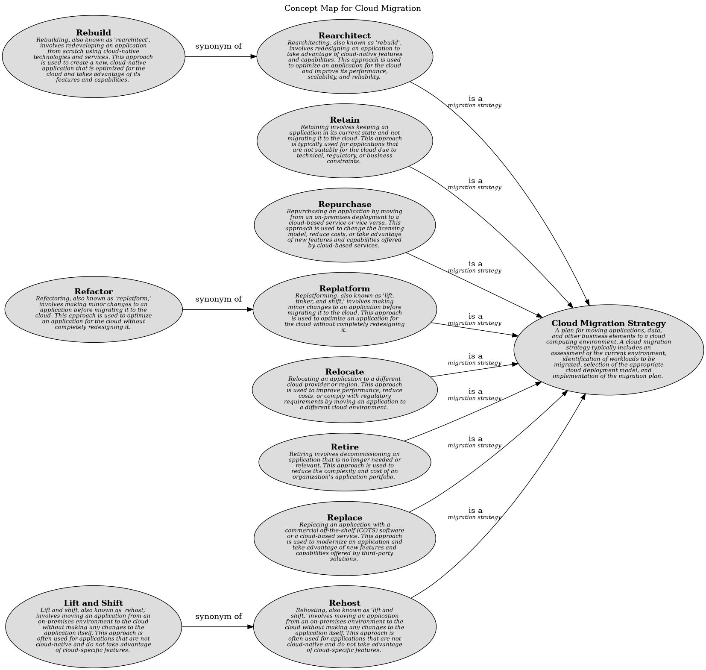

# Refactor (Concept)
## Description
Refactoring, also known as 'replatform,' involves making minor changes to an application before
          migrating it to the cloud. This approach is used to optimize an application for the cloud without
          completely redesigning it.

## Tags
strategy
## Other Relations
| From | Name | To | Description |
|---|---|---|---|
| [Refactor](../../../software-development/cloud/migration/refactor.md) | synonym of | [Replatform](../../../software-development/cloud/migration/replatform.md) |  |

## Concept Map

[Concept Map for Cloud Migration](../../../software-development/cloud/migration/concept-view.md)

## Navigation
[List of views in namespace](./views-in-namespace.md)

[List of all Views](../../../views.md)

(generated by [Overarch](https://github.com/soulspace-org/overarch) with template docs/node.md.cmb)
