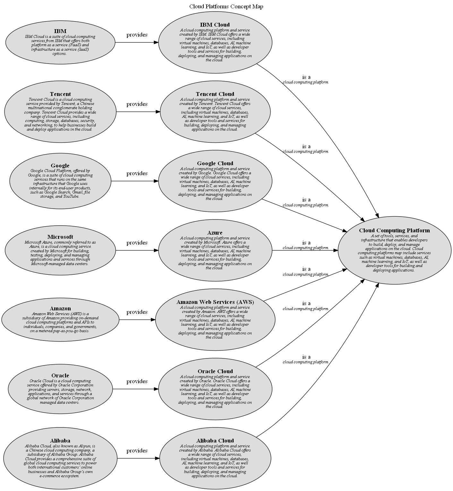

# Alibaba Cloud (Concept)
## Description
A cloud computing platform and service created by Alibaba. Alibaba Cloud offers a wide
          range of cloud services, including virtual machines, databases, AI, machine learning, and IoT, as well
          as developer tools and services for building, deploying, and managing applications on the cloud.

## Tags
alibaba, cloud, platform
## Superordinates
| Concept | Description |
|---|---|
| [Cloud Computing Platform](../../../software-development/cloud/cloud-computing-platform.md)| A  set of tools, services, and infrastructure that enables developers to build, deploy, and manage applications on the cloud. Cloud computing platforms may include services such as virtual machines, databases, AI, machine learning, and IoT, as well as developer tools for building and deploying applications. |
## Other Relations
| From | Name | To | Description |
|---|---|---|---|
| [Alibaba](../../../software-development/cloud/provider/alibaba.md) | provides | [Alibaba Cloud](../../../software-development/cloud/platform/alibaba-cloud.md) |  |

## Concept Map

[Cloud Platforms Concept Map](../../../software-development/cloud/platform/concept-view.md)

## Navigation
[List of views in namespace](./views-in-namespace.md)

[List of all Views](../../../views.md)

(generated by [Overarch](https://github.com/soulspace-org/overarch) with template docs/node.md.cmb)
