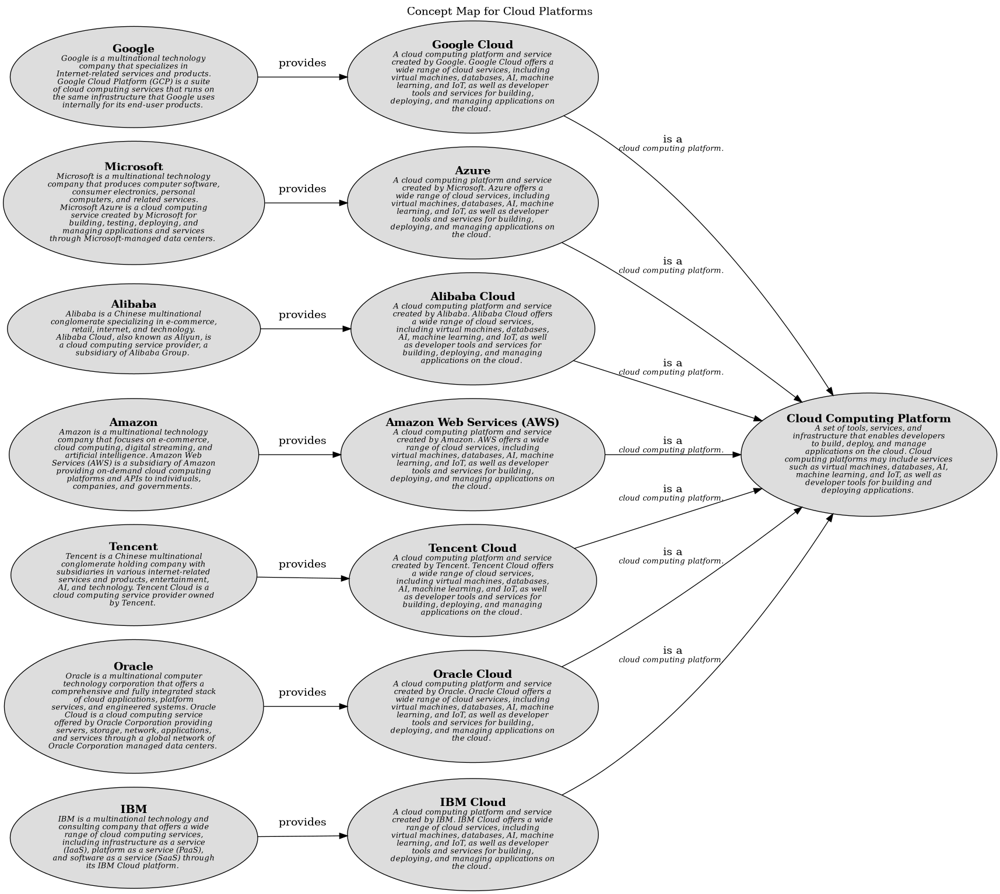

# Concept Map for Cloud Platforms

## Diagram

## Description
Shows the concepts related to cloud platforms and their relationships.

## Concepts
| Concept | Description |
|---|---|
| [Alibaba](../../../software-development/cloud/provider/alibaba.md)| Alibaba Cloud, also known as Aliyun, is a Chinese cloud computing company, a subsidiary of Alibaba Group. Alibaba Cloud provides a comprehensive suite of global cloud computing services to power both international customers’ online businesses and Alibaba Group’s own e-commerce ecosystem. |
| [Alibaba Cloud](../../../software-development/cloud/platform/alibaba-cloud.md)| A cloud computing platform and service created by Alibaba. Alibaba Cloud offers a wide range of cloud services, including virtual machines, databases, AI, machine learning, and IoT, as well as developer tools and services for building, deploying, and managing applications on the cloud. |
| [Amazon](../../../software-development/cloud/provider/amazon.md)| Amazon Web Services (AWS) is a subsidiary of Amazon providing on-demand cloud computing platforms and APIs to individuals, companies, and governments, on a metered pay-as-you-go basis. |
| [Amazon Web Services (AWS)](../../../software-development/cloud/platform/aws.md)| A cloud computing platform and service created by Amazon. AWS offers a wide range of cloud services, including virtual machines, databases, AI, machine learning, and IoT, as well as developer tools and services for building, deploying, and managing applications on the cloud. |
| [Azure](../../../software-development/cloud/platform/azure.md)| A cloud computing platform and service created by Microsoft. Azure offers a wide range of cloud services, including virtual machines, databases, AI, machine learning, and IoT, as well as developer tools and services for building, deploying, and managing applications on the cloud. |
| [Cloud Computing Platform](../../../software-development/cloud/cloud-computing-platform.md)| A  set of tools, services, and infrastructure that enables developers to build, deploy, and manage applications on the cloud. Cloud computing platforms may include services such as virtual machines, databases, AI, machine learning, and IoT, as well as developer tools for building and deploying applications. |
| [Google](../../../software-development/cloud/provider/google.md)| Google Cloud Platform, offered by Google, is a suite of cloud computing services that runs on the same infrastructure that Google uses internally for its end-user products, such as Google Search, Gmail, file storage, and YouTube. |
| [Google Cloud](../../../software-development/cloud/platform/google-cloud.md)| A cloud computing platform and service created by Google. Google Cloud offers a wide range of cloud services, including virtual machines, databases, AI, machine learning, and IoT, as well as developer tools and services for building, deploying, and managing applications on the cloud. |
| [IBM](../../../software-development/cloud/provider/ibm.md)| IBM Cloud is a suite of cloud computing services from IBM that offers both platform as a service (PaaS) and infrastructure as a service (IaaS) options. |
| [IBM Cloud](../../../software-development/cloud/platform/ibm-cloud.md)| A cloud computing platform and service created by IBM. IBM Cloud offers a wide range of cloud services, including virtual machines, databases, AI, machine learning, and IoT, as well as developer tools and services for building, deploying, and managing applications on the cloud. |
| [Microsoft](../../../software-development/cloud/provider/microsoft.md)| Microsoft Azure, commonly referred to as Azure, is a cloud computing service created by Microsoft for building, testing, deploying, and managing applications and services through Microsoft-managed data centers. |
| [Oracle](../../../software-development/cloud/provider/oracle.md)| Oracle Cloud is a cloud computing service offered by Oracle Corporation providing servers, storage, network, applications, and services through a global network of Oracle Corporation managed data centers. |
| [Oracle Cloud](../../../software-development/cloud/platform/oracle-cloud.md)| A cloud computing platform and service created by Oracle. Oracle Cloud offers a wide range of cloud services, including virtual machines, databases, AI, machine learning, and IoT, as well as developer tools and services for building, deploying, and managing applications on the cloud. |
| [Tencent](../../../software-development/cloud/provider/tencent.md)| Tencent Cloud is a cloud computing service provided by Tencent, a Chinese multinational conglomerate holding company. Tencent Cloud provides a wide range of cloud services, including computing, storage, databases, security, and networking, to help businesses build and deploy applications in the cloud. |
| [Tencent Cloud](../../../software-development/cloud/platform/tencent-cloud.md)| A cloud computing platform and service created by Tencent. Tencent Cloud offers a wide range of cloud services, including virtual machines, databases, AI, machine learning, and IoT, as well as developer tools and services for building, deploying, and managing applications on the cloud. |

## Generalizations
| From | Name | To | Description |
|---|---|---|---|
| [IBM Cloud](../../../software-development/cloud/platform/ibm-cloud.md) | is a | [Cloud Computing Platform](../../../software-development/cloud/cloud-computing-platform.md) | cloud computing platform. |
| [Alibaba Cloud](../../../software-development/cloud/platform/alibaba-cloud.md) | is a | [Cloud Computing Platform](../../../software-development/cloud/cloud-computing-platform.md) | cloud computing platform. |
| [Oracle Cloud](../../../software-development/cloud/platform/oracle-cloud.md) | is a | [Cloud Computing Platform](../../../software-development/cloud/cloud-computing-platform.md) | cloud computing platform. |
| [Google Cloud](../../../software-development/cloud/platform/google-cloud.md) | is a | [Cloud Computing Platform](../../../software-development/cloud/cloud-computing-platform.md) | cloud computing platform. |
| [Azure](../../../software-development/cloud/platform/azure.md) | is a | [Cloud Computing Platform](../../../software-development/cloud/cloud-computing-platform.md) | cloud computing platform. |
| [Tencent Cloud](../../../software-development/cloud/platform/tencent-cloud.md) | is a | [Cloud Computing Platform](../../../software-development/cloud/cloud-computing-platform.md) | cloud computing platform. |
| [Amazon Web Services (AWS)](../../../software-development/cloud/platform/aws.md) | is a | [Cloud Computing Platform](../../../software-development/cloud/cloud-computing-platform.md) | cloud computing platform. |

## Other Relationships
| From | Name | To | Description |
|---|---|---|---|
| [Alibaba](../../../software-development/cloud/provider/alibaba.md) | provides | [Alibaba Cloud](../../../software-development/cloud/platform/alibaba-cloud.md) |  |
| [IBM](../../../software-development/cloud/provider/ibm.md) | provides | [IBM Cloud](../../../software-development/cloud/platform/ibm-cloud.md) |  |
| [Oracle](../../../software-development/cloud/provider/oracle.md) | provides | [Oracle Cloud](../../../software-development/cloud/platform/oracle-cloud.md) |  |
| [Amazon](../../../software-development/cloud/provider/amazon.md) | provides | [Amazon Web Services (AWS)](../../../software-development/cloud/platform/aws.md) |  |
| [Microsoft](../../../software-development/cloud/provider/microsoft.md) | provides | [Azure](../../../software-development/cloud/platform/azure.md) |  |
| [Tencent](../../../software-development/cloud/provider/tencent.md) | provides | [Tencent Cloud](../../../software-development/cloud/platform/tencent-cloud.md) |  |
| [Google](../../../software-development/cloud/provider/google.md) | provides | [Google Cloud](../../../software-development/cloud/platform/google-cloud.md) |  |

## Navigation
[List of views in namespace](./views-in-namespace.md)

[List of all Views](../../../views.md)

(generated by [Overarch](https://github.com/soulspace-org/overarch) with template docs/views/view.md.cmb)

