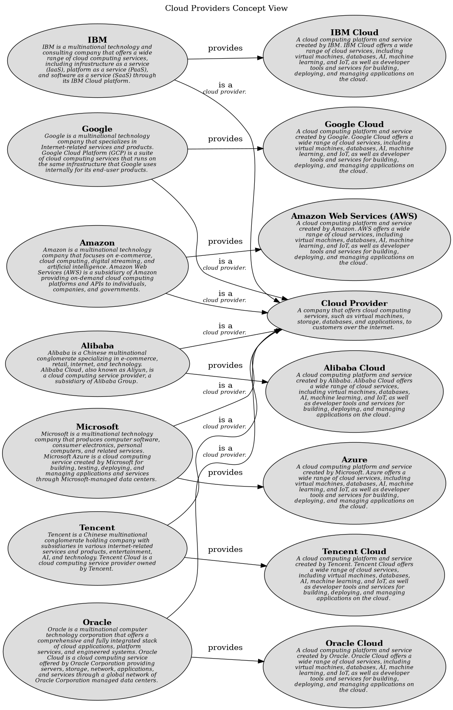

# Cloud Providers Concept View

## Diagram

## Description
Shows the concepts related to cloud providers and their relationships.

## Concepts
| Concept | Description |
|---|---|
| [Alibaba](../../../software-development/cloud/provider/alibaba.md)| Alibaba is a Chinese multinational conglomerate specializing in e-commerce, retail, internet, and technology. Alibaba Cloud, also known as Aliyun, is a cloud computing service provider, a subsidiary of Alibaba Group. |
| [Alibaba Cloud](../../../software-development/cloud/platform/alibaba-cloud.md)| A cloud computing platform and service created by Alibaba. Alibaba Cloud offers a wide range of cloud services, including virtual machines, databases, AI, machine learning, and IoT, as well as developer tools and services for building, deploying, and managing applications on the cloud. |
| [Amazon](../../../software-development/cloud/provider/amazon.md)| Amazon is a multinational technology company that focuses on e-commerce, cloud computing, digital streaming, and artificial intelligence. Amazon Web Services (AWS) is a subsidiary of Amazon providing on-demand cloud computing platforms and APIs to individuals, companies, and governments. |
| [Amazon Web Services (AWS)](../../../software-development/cloud/platform/aws.md)| A cloud computing platform and service created by Amazon. AWS offers a wide range of cloud services, including virtual machines, databases, AI, machine learning, and IoT, as well as developer tools and services for building, deploying, and managing applications on the cloud. |
| [Azure](../../../software-development/cloud/platform/azure.md)| A cloud computing platform and service created by Microsoft. Azure offers a wide range of cloud services, including virtual machines, databases, AI, machine learning, and IoT, as well as developer tools and services for building, deploying, and managing applications on the cloud. |
| [Cloud Provider](../../../software-development/cloud/cloud-provider.md)| A company that offers cloud computing services, such as virtual machines, storage, databases, and applications, to customers over the internet. |
| [Google](../../../software-development/cloud/provider/google.md)| Google is a multinational technology company that specializes in Internet-related services and products. Google Cloud Platform (GCP) is a suite of cloud computing services that runs on the same infrastructure that Google uses internally for its end-user products. |
| [Google Cloud](../../../software-development/cloud/platform/google-cloud.md)| A cloud computing platform and service created by Google. Google Cloud offers a wide range of cloud services, including virtual machines, databases, AI, machine learning, and IoT, as well as developer tools and services for building, deploying, and managing applications on the cloud. |
| [IBM](../../../software-development/cloud/provider/ibm.md)| IBM is a multinational technology and consulting company that offers a wide range of cloud computing services, including infrastructure as a service (IaaS), platform as a service (PaaS), and software as a service (SaaS) through its IBM Cloud platform. |
| [IBM Cloud](../../../software-development/cloud/platform/ibm-cloud.md)| A cloud computing platform and service created by IBM. IBM Cloud offers a wide range of cloud services, including virtual machines, databases, AI, machine learning, and IoT, as well as developer tools and services for building, deploying, and managing applications on the cloud. |
| [Microsoft](../../../software-development/cloud/provider/microsoft.md)| Microsoft is a multinational technology company that produces computer software, consumer electronics, personal computers, and related services. Microsoft Azure is a cloud computing service created by Microsoft for building, testing, deploying, and managing applications and services through Microsoft-managed data centers. |
| [Oracle](../../../software-development/cloud/provider/oracle.md)| Oracle is a multinational computer technology corporation that offers a comprehensive and fully integrated stack of cloud applications, platform services, and engineered systems. Oracle Cloud is a cloud computing service offered by Oracle Corporation providing servers, storage, network, applications, and services through a global network of Oracle Corporation managed data centers. |
| [Oracle Cloud](../../../software-development/cloud/platform/oracle-cloud.md)| A cloud computing platform and service created by Oracle. Oracle Cloud offers a wide range of cloud services, including virtual machines, databases, AI, machine learning, and IoT, as well as developer tools and services for building, deploying, and managing applications on the cloud. |
| [Tencent](../../../software-development/cloud/provider/tencent.md)| Tencent is a Chinese multinational conglomerate holding company with subsidiaries in various internet-related services and products, entertainment, AI, and technology. Tencent Cloud is a cloud computing service provider owned by Tencent. |
| [Tencent Cloud](../../../software-development/cloud/platform/tencent-cloud.md)| A cloud computing platform and service created by Tencent. Tencent Cloud offers a wide range of cloud services, including virtual machines, databases, AI, machine learning, and IoT, as well as developer tools and services for building, deploying, and managing applications on the cloud. |

## Generalizations
| From | Name | To | Description |
|---|---|---|---|
| [Alibaba](../../../software-development/cloud/provider/alibaba.md) | is a | [Cloud Provider](../../../software-development/cloud/cloud-provider.md) | cloud provider. |
| [Google](../../../software-development/cloud/provider/google.md) | is a | [Cloud Provider](../../../software-development/cloud/cloud-provider.md) | cloud provider. |
| [Oracle](../../../software-development/cloud/provider/oracle.md) | is a | [Cloud Provider](../../../software-development/cloud/cloud-provider.md) | cloud provider. |
| [Tencent](../../../software-development/cloud/provider/tencent.md) | is a | [Cloud Provider](../../../software-development/cloud/cloud-provider.md) | cloud provider. |
| [Microsoft](../../../software-development/cloud/provider/microsoft.md) | is a | [Cloud Provider](../../../software-development/cloud/cloud-provider.md) | cloud provider. |
| [IBM](../../../software-development/cloud/provider/ibm.md) | is a | [Cloud Provider](../../../software-development/cloud/cloud-provider.md) | cloud provider. |
| [Amazon](../../../software-development/cloud/provider/amazon.md) | is a | [Cloud Provider](../../../software-development/cloud/cloud-provider.md) | cloud provider. |

## Other Relationships
| From | Name | To | Description |
|---|---|---|---|
| [Alibaba](../../../software-development/cloud/provider/alibaba.md) | provides | [Alibaba Cloud](../../../software-development/cloud/platform/alibaba-cloud.md) |  |
| [IBM](../../../software-development/cloud/provider/ibm.md) | provides | [IBM Cloud](../../../software-development/cloud/platform/ibm-cloud.md) |  |
| [Oracle](../../../software-development/cloud/provider/oracle.md) | provides | [Oracle Cloud](../../../software-development/cloud/platform/oracle-cloud.md) |  |
| [Amazon](../../../software-development/cloud/provider/amazon.md) | provides | [Amazon Web Services (AWS)](../../../software-development/cloud/platform/aws.md) |  |
| [Microsoft](../../../software-development/cloud/provider/microsoft.md) | provides | [Azure](../../../software-development/cloud/platform/azure.md) |  |
| [Tencent](../../../software-development/cloud/provider/tencent.md) | provides | [Tencent Cloud](../../../software-development/cloud/platform/tencent-cloud.md) |  |
| [Google](../../../software-development/cloud/provider/google.md) | provides | [Google Cloud](../../../software-development/cloud/platform/google-cloud.md) |  |

## Navigation
[List of views in namespace](./views-in-namespace.md)

[List of all Views](../../../views.md)

(generated by [Overarch](https://github.com/soulspace-org/overarch) with template docs/views/view.md.cmb)

