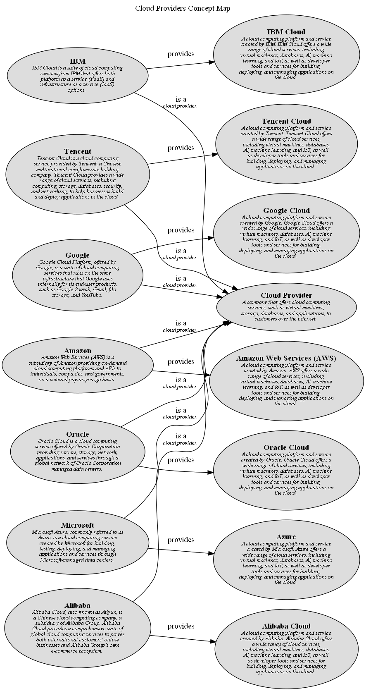

# Google (Concept)
## Description
Google Cloud Platform, offered by Google, is a suite of cloud computing services that runs on the same infrastructure that Google uses internally for its end-user products, such as Google Search, Gmail, file storage, and YouTube.

## Superordinates
| Concept | Description |
|---|---|
| [Cloud Provider](../../../software-development/cloud/cloud-provider.md)| A company that offers cloud computing services, such as virtual machines, storage, databases, and applications, to customers over the internet. |

## Concept Map

[Cloud Providers Concept Map](../../../software-development/cloud/provider/concept-view.md)

## Navigation
[List of views in namespace](./views-in-namespace.md)

[List of all Views](../../../views.md)

(generated by [Overarch](https://github.com/soulspace-org/overarch) with template docs/node.md.cmb)
