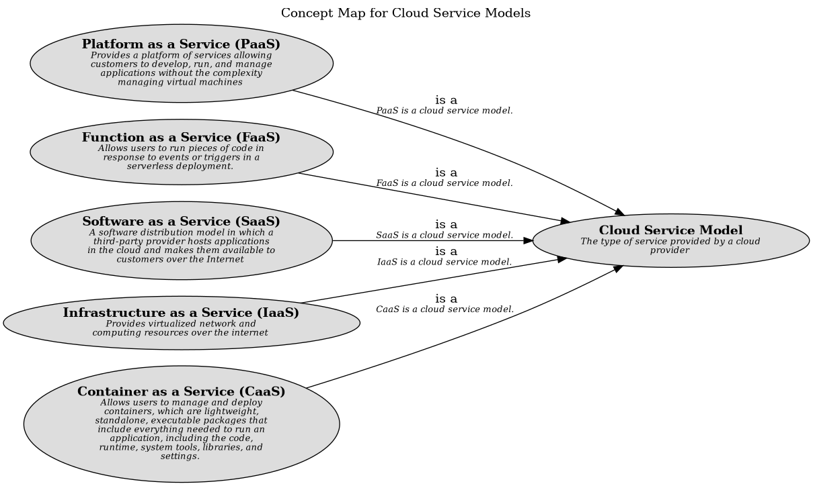

# Function as a Service (FaaS) (Concept)
## Description
Allows users to run pieces of code in response to events or triggers in a serverless deployment.

## Tags
model

## Documentation
Function as a Service (FaaS) is a cloud computing service that allows users to run
pieces of code in response to events or triggers in a serverless deployment. FaaS abstracts the
underlying infrastructure and allows developers to focus on writing and deploying functions that
respond to specific events or triggers.
FaaS is a pay-as-you-go service, with users only paying for the compute time used
to run the functions. FaaS is ideal for event-driven applications, such as IoT
applications, real-time data processing, and webhooks.
## Superordinates
| Concept | Description |
|---|---|
| [Cloud Service Model](../../../software-development/cloud/cloud-service-model.md)| The type of service provided by a cloud provider |

## Concept Map

[Cloud Service Models Concept Map](../../../software-development/cloud/service-model/concept-view.md)

## Navigation
[List of views in namespace](./views-in-namespace.md)

[List of all Views](../../../views.md)

(generated by [Overarch](https://github.com/soulspace-org/overarch) with template docs/node.md.cmb)
