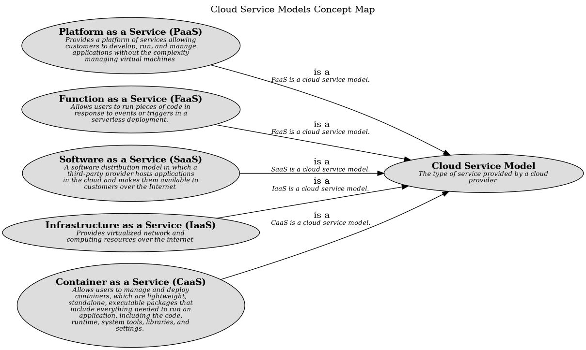

# Infrastructure as a Service (IaaS) (Concept)
## Description
Provides virtualized network and computing resources over the internet

## Tags
model

## Documentation
Infrastructure as a Service (IaaS) is a cloud service model that provides virtualized
computing resources over the Internet. IaaS provides virtual machines, storage, and networking
resources that can be used to build, deploy, and manage applications in the cloud. It is
essentially a replica of a traditional data center, but hosted and managed by a cloud provider.
## Superordinates
| Concept | Description |
|---|---|
| [Cloud Service Model](../../../software-development/cloud/cloud-service-model.md)| The type of service provided by a cloud provider |

## Concept Map

[Concept Map for Cloud Service Models](../../../software-development/cloud/service-model/concept-view.md)

## Navigation
[List of views in namespace](./views-in-namespace.md)

[List of all Views](../../../views.md)

(generated by [Overarch](https://github.com/soulspace-org/overarch) with template docs/node.md.cmb)
