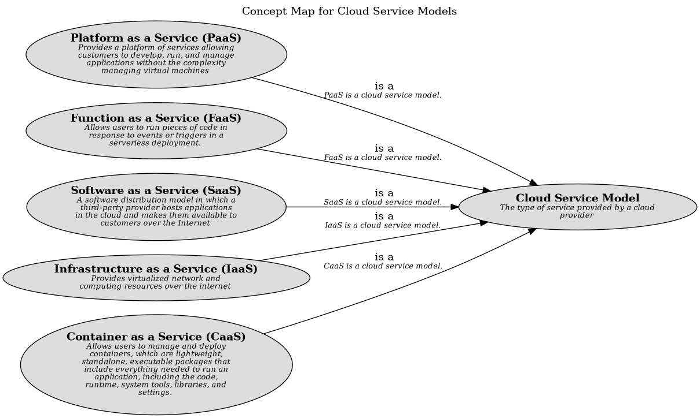

# Platform as a Service (PaaS) (Concept)
## Description
Provides a platform of services allowing customers to develop, run, and manage applications without the complexity managing virtual machines

## Tags
model

## Documentation
Platform as a Service (PaaS) is a cloud service model that provides a platform of services allowing customers to
develop, run, and manage applications without the complexity of building and maintaining the infrastructure typically
associated with developing and launching an app. It provides a complete development and deployment environment in the
cloud, with resources that allow developers to build, test, and deploy applications based on computing, storage, and
networking services provided by the cloud provider.
## Superordinates
| Concept | Description |
|---|---|
| [Cloud Service Model](../../../software-development/cloud/cloud-service-model.md)| The type of service provided by a cloud provider |

## Concept Map

[Cloud Service Models Concept Map](../../../software-development/cloud/service-model/concept-view.md)

## Navigation
[List of views in namespace](./views-in-namespace.md)

[List of all Views](../../../views.md)

(generated by [Overarch](https://github.com/soulspace-org/overarch) with template docs/node.md.cmb)
