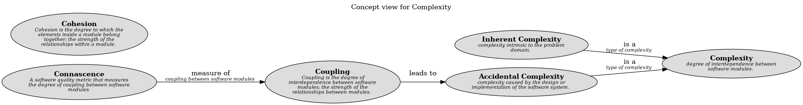

# Complexity (Concept)
## Description
degree of interdependence between software modules.

## Documentation
Complexity is the degree of difficulty in understanding, designing, and maintaining a software system.
## Subordinates
| Concept | Description |
|---|---|
| [Accidental Complexity](../../software-development/complexity/accidental-complexity.md)| complexity caused by the design or implementation of the software system. |
| [Inherent Complexity](../../software-development/complexity/inherent-complexity.md)| complexity intrinsic to the problem domain. |

## Concept Map

[Concept view for Complexity](../../software-development/complexity/concept-view.md)

## Navigation
[List of views in namespace](./views-in-namespace.md)

[List of all Views](../../views.md)

(generated by [Overarch](https://github.com/soulspace-org/overarch) with template docs/node.md.cmb)
