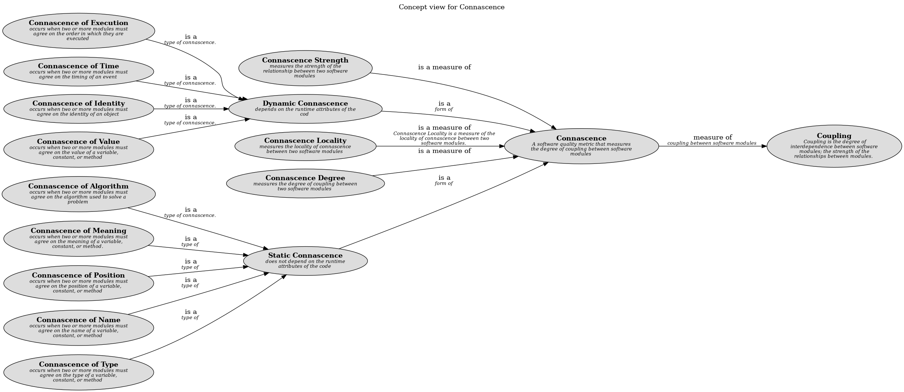

# Connascence Strength (Concept)
## Description
measures the strength of the relationship between two software modules

## Tags
generic, design, metric, connascence

## Documentation
Connascence Strength is a measure of the strength of the relationship between two software modules. It is a measure of the strength of the relationship between two software modules.
## Other Relations
| From | Name | To | Description |
|---|---|---|---|
| [Connascence Strength](../../../software-development/complexity/connascence/connascence-strength.md) | is a measure of | [Connascence](../../../software-development/complexity/connascence/connascence.md) |  |

## Concept Map

[Concept view for Connascence](../../../software-development/complexity/connascence/concept-view.md)

## Navigation
[List of views in namespace](./views-in-namespace.md)

[List of all Views](../../../views.md)

(generated by [Overarch](https://github.com/soulspace-org/overarch) with template docs/node.md.cmb)
