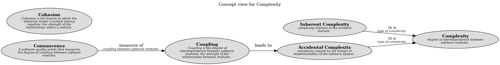

# Coupling (Concept)
## Description
Coupling is the degree of interdependence between software modules;
            a measure of how closely connected two routines or modules are;
            the strength of the relationships between modules.

## Tags
generic, concept, design

## Documentation
Coupling is the degree of interdependence between software modules.
  It is a measure of how closely connected two routines or modules are.
  It is a measure of the strength of the relationships between modules.
  There are several types of coupling, including data coupling, control coupling,
  common coupling, content coupling, and stamp coupling.
  Coupling also has the properties coupling degree, coupling strength, and coupling locality.
## Other Relations
| From | Name | To | Description |
|---|---|---|---|
| [Connascence](../../software-development/complexity/connascence/connascence.md) | measure of | [Coupling](../../software-development/complexity/coupling.md) | coupling between software modules |

## Concept Map

[Concept view for Complexity](../../software-development/complexity/concept-view.md)

## Navigation
[List of views in namespace](./views-in-namespace.md)

[List of all Views](../../views.md)

(generated by [Overarch](https://github.com/soulspace-org/overarch) with template docs/node.md.cmb)
