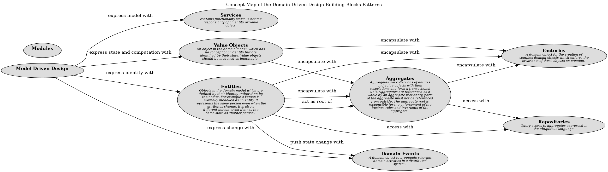

# Services (Concept)
## Description
contains functionality which is not the responsiblity of an entity or value object

## Tags
pattern

## Documentation
Sometimes, it just isn't a thing.

Some concepts from the domain aren't natural to model as objects. Forcing the
required domain functionality to be the responsibility of an ENTITY or VALUE
either distorts the definition of a model-based object or adds meaningless
artificial objects.

Therefore,

When a significant process or transformation in the domain is not a natural
responsibility of an ENTITY or VALUE OBJECT, add an operation to the model
as a standalone interface declared as a SERVICE. Define a service contract, a
set of assertions about interactions with the service. (See assertions.) State
these assertions in the ubiquitous language of a specific bounded context.
Give the service a name, which also becomes part of the ubiquitous language.
## Other Relations
| From | Name | To | Description |
|---|---|---|---|
| [Model Driven Design](../../../software-development/domain-driven-design/modelling/c-model-driven-design.md) | express model with | [Services](../../../software-development/domain-driven-design/building-blocks/c-services.md) |  |

## Concept Map

[Concept Map of the Domain Driven Design Building Blocks Patterns](../../../software-development/domain-driven-design/building-blocks/concept-view.md)

## Navigation
[List of views in namespace](./views-in-namespace.md)

[List of all Views](../../../views.md)

(generated by [Overarch](https://github.com/soulspace-org/overarch) with template docs/node.md.cmb)
