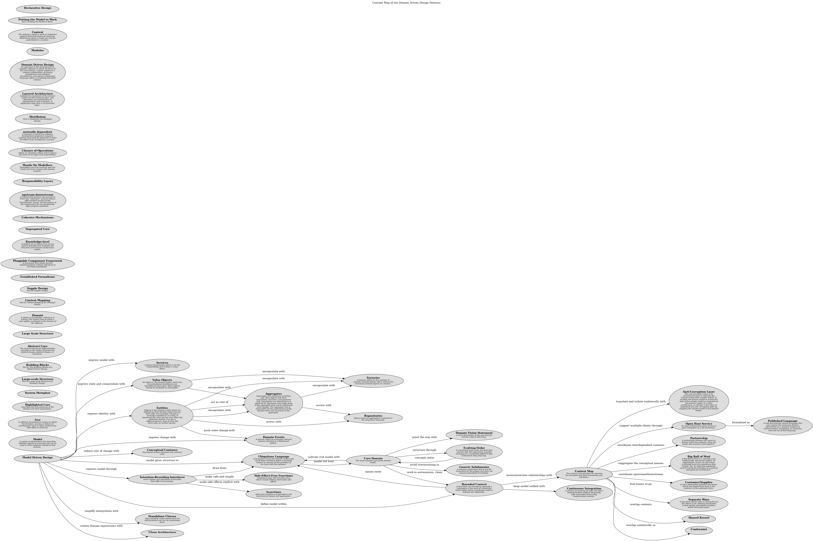

# Generic Subdomains (Concept)
## Description
A cohesive subdomain that is not the motivation for the project and does
not capoure specialized knowledge.

## Tags
pattern

## Documentation
Some parts of the model add complexity without capturing or communicating
specialized knowledge. Anything extraneous makes the core domain harder to
discern and understand. The model clogs up with general principles everyone
knows or details that belong to specialties which are not your primary focus
but play a supporting role. Yet, however generic, these other elements are
essential to the functioning of the system and the full expression of the
model.

Therefore,

Identify cohesive subdomains that are not the motivation for your project.
Factor out generic models of these subdomains and place them in separate
modules. Leave no trace of your specialties in them.

Once they have been separated, give their continuing development lower priority
than the core domain, and avoid assigning your core developers to the tasks
(because they will gain little domain knowledge from them). Also consider
off-the-shelf solutions or published models for these generic subdomains.
## Other Relations
| From | Name | To | Description |
|---|---|---|---|
| [Core Domain](../../software-development/domain-driven-design/c-core-domain.md) | avoid overinvesting in | [Generic Subdomains](../../software-development/domain-driven-design/c-generic-subdomains.md) |  |

## Concept Map

[Concept Map of the Domain Driven Design Patterns](../../software-development/domain-driven-design/concept-view.md)

## Navigation
[List of views in namespace](./views-in-namespace.md)

[List of all Views](../../views.md)

(generated by [Overarch](https://github.com/soulspace-org/overarch) with template docs/node.md.cmb)
