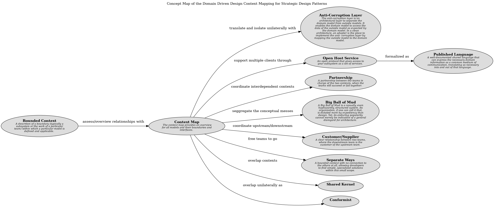

# Published Language (Concept)
## Description
A well-documented shared language that can express the necessary domain
information as a common medium of communication, translating as necessary into
and out of that language.

## Tags
pattern

## Documentation
The translation between the models of two bounded contexts requires a common
language.

Direct translation to and from the existing domain models may not be a good
solution. Those models may be overly complex or poorly factored. They are
probably undocumented. If one is used as a data interchange language, it
essentially becomes frozen and cannot respond to new development needs.

Therefore,

Use a well-documented shared language that can express the necessary domain
information as a common medium of communication, translating as necessary into
and out of that language.

Many industries establish published languages in the form of data interchange
standards. Project teams also develop their own for use within their
organization.

Published language is often combined with open-host service.
## Other Relations
| From | Name | To | Description |
|---|---|---|---|
| [Open Host Service](../../../software-development/domain-driven-design/context-mapping/c-open-host-service.md) | formalized as | [Published Language](../../../software-development/domain-driven-design/context-mapping/c-published-language.md) |  |

## Concept Map

[Concept Map of the Domain Driven Design Context Mapping for Strategic Design Patterns](../../../software-development/domain-driven-design/context-mapping/concept-view.md)

## Navigation
[List of views in namespace](./views-in-namespace.md)

[List of all Views](../../../views.md)

(generated by [Overarch](https://github.com/soulspace-org/overarch) with template docs/node.md.cmb)
