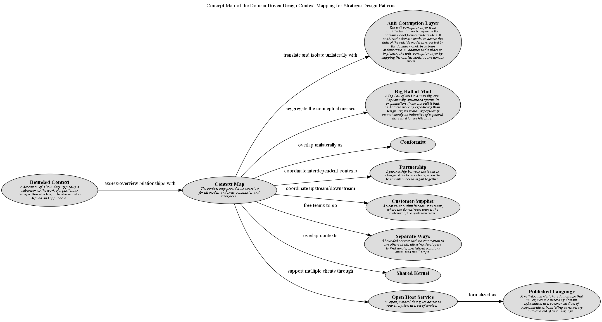

# Concept Map of the Domain Driven Design Context Mapping for Strategic Design Patterns

## Diagram

## Description
Shows the patterns of context mapping for strategic design and their relationships.

## Concepts
| Concept | Description |
|---|---|
| [Anti-Corruption Layer](../../../software-development/domain-driven-design/context-mapping/c-anti-corruption-layer.md)| The anti-corruption layer is an architectural layer to separate the domain model from outside models. It enables the domain model to access the data of the outside model as expected by the domain model. In a clean architecture, an adapter is the place to implement the anti- corruption layer by mapping the outside model to the domain model. |
| [Big Ball of Mud](../../../software-development/domain-driven-design/context-mapping/c-big-ball-of-mud.md)| A Big Ball of Mud is a casually, even haphazardly, structured system. Its organization, if one can call it that, is dictated more by expediency than design. Yet, its enduring popularity cannot merely be indicative of a general disregard for architecture. |
| [Bounded Context](../../../software-development/domain-driven-design/modelling/c-bounded-context.md)| A descrition of a boundary (typically a subsystem or the work of a particular team) within which a particular model is defined and applicable. |
| [Conformist](../../../software-development/domain-driven-design/context-mapping/c-conformist.md)|  |
| [Context Map](../../../software-development/domain-driven-design/context-mapping/c-context-map.md)| The context map provides an overview for all models and their boundaries and interfaces. |
| [Customer/Supplier](../../../software-development/domain-driven-design/context-mapping/c-customer-supplier.md)| A clear relationship between two teams, where the downstream team is the customer of the upstream team. |
| [Open Host Service](../../../software-development/domain-driven-design/context-mapping/c-open-host-service.md)| An open protocol that gives access to your subsystem as a set of services. |
| [Partnership](../../../software-development/domain-driven-design/context-mapping/c-partnership.md)| A partnership between the teams in charge of the two contexts, when the teams will succeed or fail together. |
| [Published Language](../../../software-development/domain-driven-design/context-mapping/c-published-language.md)| A well-documented shared language that can express the necessary domain information as a common medium of communication, translating as necessary into and out of that language. |
| [Separate Ways](../../../software-development/domain-driven-design/context-mapping/c-separate-ways.md)| A bounded context with no connection to the others at all, allowing developers to find simple, specialized solutions within this small scope. |
| [Shared Kernel](../../../software-development/domain-driven-design/context-mapping/c-shared-kernel.md)|  |

## Other Relationships
| From | Name | To | Description |
|---|---|---|---|
| [Bounded Context](../../../software-development/domain-driven-design/modelling/c-bounded-context.md) | assess/overview relationships with | [Context Map](../../../software-development/domain-driven-design/context-mapping/c-context-map.md) |  |
| [Context Map](../../../software-development/domain-driven-design/context-mapping/c-context-map.md) | coordinate interdependent contexts | [Partnership](../../../software-development/domain-driven-design/context-mapping/c-partnership.md) |  |
| [Context Map](../../../software-development/domain-driven-design/context-mapping/c-context-map.md) | coordinate upstream/downstream | [Customer/Supplier](../../../software-development/domain-driven-design/context-mapping/c-customer-supplier.md) |  |
| [Open Host Service](../../../software-development/domain-driven-design/context-mapping/c-open-host-service.md) | formalized as | [Published Language](../../../software-development/domain-driven-design/context-mapping/c-published-language.md) |  |
| [Context Map](../../../software-development/domain-driven-design/context-mapping/c-context-map.md) | free teams to go | [Separate Ways](../../../software-development/domain-driven-design/context-mapping/c-separate-ways.md) |  |
| [Context Map](../../../software-development/domain-driven-design/context-mapping/c-context-map.md) | overlap contexts | [Shared Kernel](../../../software-development/domain-driven-design/context-mapping/c-shared-kernel.md) |  |
| [Context Map](../../../software-development/domain-driven-design/context-mapping/c-context-map.md) | overlap unilaterally as | [Conformist](../../../software-development/domain-driven-design/context-mapping/c-conformist.md) |  |
| [Context Map](../../../software-development/domain-driven-design/context-mapping/c-context-map.md) | seggregate the conceptual messes | [Big Ball of Mud](../../../software-development/domain-driven-design/context-mapping/c-big-ball-of-mud.md) |  |
| [Context Map](../../../software-development/domain-driven-design/context-mapping/c-context-map.md) | support multiple clients through | [Open Host Service](../../../software-development/domain-driven-design/context-mapping/c-open-host-service.md) |  |
| [Context Map](../../../software-development/domain-driven-design/context-mapping/c-context-map.md) | translate and isolate unilaterally with | [Anti-Corruption Layer](../../../software-development/domain-driven-design/context-mapping/c-anti-corruption-layer.md) |  |

## Navigation
[List of views in namespace](./views-in-namespace.md)

[List of all Views](../../../views.md)

(generated by [Overarch](https://github.com/soulspace-org/overarch) with template docs/views/view.md.cmb)

