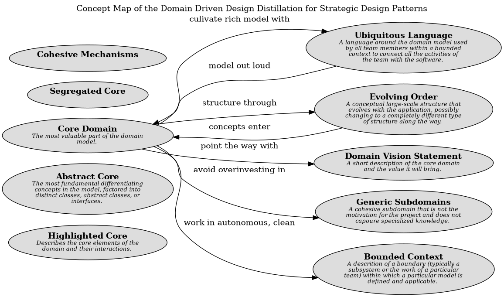

# Abstract Core (Concept)
## Description
The most fundamental differentiating concepts in the model, factored
into distinct classes, abstract classes, or interfaces.

## Tags
pattern

## Documentation
Even the core domain model usually has so much detail that communicating the
big picture can be difficult.

When there is a lot of interaction between subdomains in separate modules,
either many references will have to be created between modules, which defeats
much of the value of the partitioning, or the interaction will have to be made
indirect, which makes the model obscure.

Therefore:

Identify the most fundamental differentiating concepts in the model and factor
them into distinct classes, abstract classes, or interfaces. Design this
abstract model so that it expresses most of the interaction between significant
components. Place this abstract overall model in its own module, while the
specialized, detailed implementation classes are left in their own modules
defined by subdomain.

## Concept Map

[Concept Map of the Domain Driven Design Distillation for Strategic Design Patterns](../../../software-development/domain-driven-design/distillation/concept-view.md)

## Navigation
[List of views in namespace](./views-in-namespace.md)

[List of all Views](../../../views.md)

(generated by [Overarch](https://github.com/soulspace-org/overarch) with template docs/node.md.cmb)
