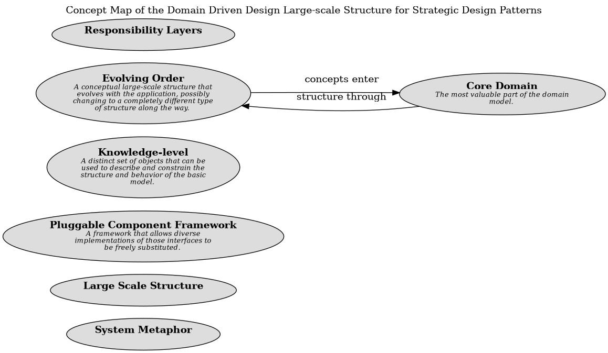

# Responsibility Layers (Concept)
## Description

## Tags
pattern

## Documentation
In object-oriented design, individual objects are assigned narrow sets of
related responsibilities. Responsibility-driven design also applies to larger
scales.

When each individual object has handcrafted responsibilities, there are no
guidelines, no  uniformity, and no ability to handle large swaths of the
domain together. To give coherence to a large model, it is useful to impose
some structure on the assignment of those responsibilities.

Therefore:

Look at the conceptual dependencies in your model and the varying rates and
sources of change of different parts of your domain. If you identify natural
strata in the domain, cast them as broad abstract responsibilities. These
responsibilities should tell a story of the high-level purpose and design of
your system. Refactor the model so that the responsibilities of each domain
object, aggregate, and module fit neatly within the responsibility of one
layer.

## Concept Map

[Concept Map of the Domain Driven Design Large-scale Structure for Strategic Design Patterns](../../../software-development/domain-driven-design/large-scale-structure/concept-view.md)

## Navigation
[List of views in namespace](./views-in-namespace.md)

[List of all Views](../../../views.md)

(generated by [Overarch](https://github.com/soulspace-org/overarch) with template docs/node.md.cmb)
