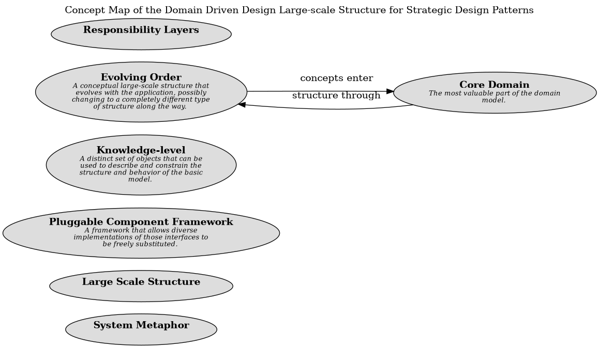

# Concept Map of the Domain Driven Design Large-scale Structure for Strategic Design Patterns

## Diagram

## Description
Shows the large-scale structure patterns and their relationships.

## Concepts
| Concept | Description |
|---|---|
| [Core Domain](../../../software-development/domain-driven-design/distillation/c-core-domain.md)| The most valuable part of the domain model. |
| [Evolving Order](../../../software-development/domain-driven-design/large-scale-structure/c-evolving-order.md)| A conceptual large-scale structure that evolves with the application, possibly changing to a completely different type of structure along the way. |
| [Knowledge-level](../../../software-development/domain-driven-design/large-scale-structure/c-knowledge-level.md)| A distinct set of objects that can be used to describe and constrain the structure and behavior of the basic model. |
| [Large Scale Structure](../../../software-development/domain-driven-design/large-scale-structure/c-large-scale-structure.md)|  |
| [Pluggable Component Framework](../../../software-development/domain-driven-design/large-scale-structure/c-pluggable-component-framework.md)| A framework that allows diverse implementations of those interfaces to be freely substituted. |
| [Responsibility Layers](../../../software-development/domain-driven-design/large-scale-structure/c-responsibility-layers.md)|  |
| [System Metaphor](../../../software-development/domain-driven-design/large-scale-structure/c-system-metaphor.md)|  |

## Other Relationships
| From | Name | To | Description |
|---|---|---|---|
| [Evolving Order](../../../software-development/domain-driven-design/large-scale-structure/c-evolving-order.md) | concepts enter | [Core Domain](../../../software-development/domain-driven-design/distillation/c-core-domain.md) |  |
| [Core Domain](../../../software-development/domain-driven-design/distillation/c-core-domain.md) | structure through | [Evolving Order](../../../software-development/domain-driven-design/large-scale-structure/c-evolving-order.md) |  |

## Navigation
[List of views in namespace](./views-in-namespace.md)

[List of all Views](../../../views.md)

(generated by [Overarch](https://github.com/soulspace-org/overarch) with template docs/views/view.md.cmb)

