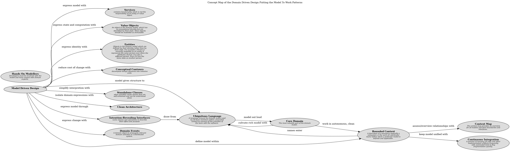

# Continuous Integration (Concept)
## Description
A process of merging all code and other implementation artifacts
frequently, with automated tests to flag fragmentation quickly.

## Tags
pattern

## Documentation
Once a bounded context has been defined, we must keep it sound. When a number
of people are working in the same bounded context, there is a strong tendency
for the model to fragment.
The bigger the team, the bigger the problem, but as few as three or four people
can encounter serious problems. Yet breaking down the system into ever-smaller
contexts eventually loses a valuable level of integration and coherency.

Therefore,

Institute a process of merging all code and other implementation artifacts
frequently, with automated tests to flag fragmentation quickly.
Relentlessly exercise the ubiquitous language to hammer out a shared view of
the model as the concepts evolve in different people's heads.
## Other Relations
| From | Name | To | Description |
|---|---|---|---|
| [Bounded Context](../../../software-development/domain-driven-design/modelling/c-bounded-context.md) | keep model unified with | [Continuous Integration](../../../software-development/domain-driven-design/modelling/c-continuous-integration.md) |  |

## Concept Map

[Concept Map of the Domain Driven Design Putting the Model To Work Patterns](../../../software-development/domain-driven-design/modelling/concept-view.md)

## Navigation
[List of views in namespace](./views-in-namespace.md)

[List of all Views](../../../views.md)

(generated by [Overarch](https://github.com/soulspace-org/overarch) with template docs/node.md.cmb)
