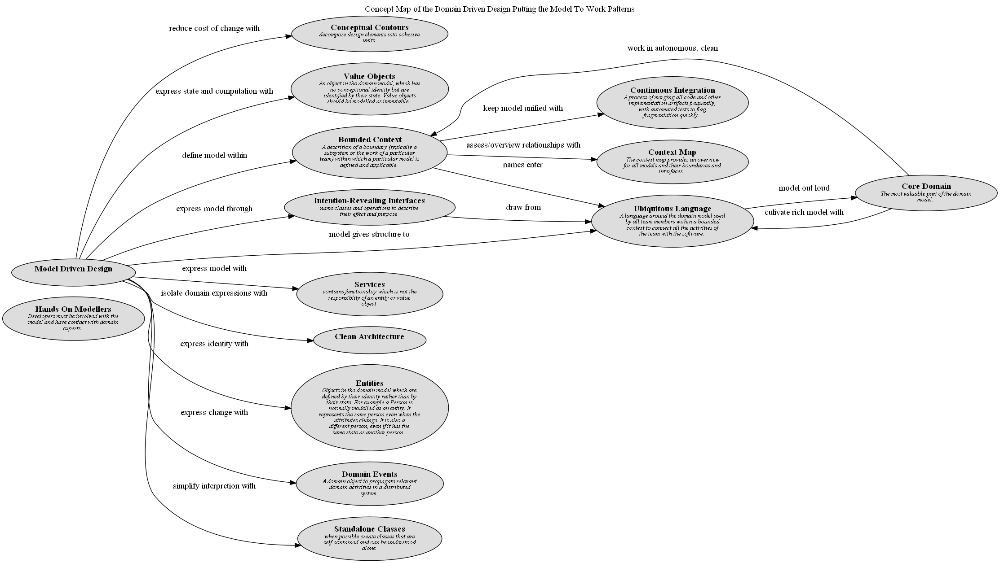

# Concept Map of the Domain Driven Design Putting the Model To Work Patterns

## Diagram

## Description
Shows the modelling patterns and their relationships.

## Concepts
| Concept | Description |
|---|---|
| [Bounded Context](../../../software-development/domain-driven-design/modelling/c-bounded-context.md)| A descrition of a boundary (typically a subsystem or the work of a particular team) within which a particular model is defined and applicable. |
| [Clean Architecture](../../../software-development/domain-driven-design/c-clean-architecture.md)|  |
| [Conceptual Contours](../../../software-development/domain-driven-design/supple-design/conceptual-contours.md)| decompose design elements into cohesive units |
| [Context Map](../../../software-development/domain-driven-design/context-mapping/c-context-map.md)| The context map provides an overview for all models and their boundaries and interfaces. |
| [Continuous Integration](../../../software-development/domain-driven-design/modelling/c-continuous-integration.md)| A process of merging all code and other implementation artifacts frequently, with automated tests to flag fragmentation quickly. |
| [Core Domain](../../../software-development/domain-driven-design/distillation/c-core-domain.md)| The most valuable part of the domain model. |
| [Domain Events](../../../software-development/domain-driven-design/building-blocks/c-domain-events.md)| A domain object to propagate relevant domain activities in a distributed system. |
| [Entities](../../../software-development/domain-driven-design/building-blocks/c-entities.md)| Objects in the domain model which are defined by their identity rather than by their state. For example a Person is normally modelled as an entity. It represents the same person even when the attributes change. It is also a different person, even if it has the same state as another person. |
| [Hands On Modellers](../../../software-development/domain-driven-design/modelling/c-hands-on-modellers.md)| Developers must be involved with the model and have contact with domain experts. |
| [Intention-Revealing Interfaces](../../../software-development/domain-driven-design/supple-design/intention-revealing-interfaces.md)| name classes and operations to describe their effect and purpose |
| [Model Driven Design](../../../software-development/domain-driven-design/modelling/c-model-driven-design.md)|  |
| [Services](../../../software-development/domain-driven-design/building-blocks/c-services.md)| contains functionality which is not the responsiblity of an entity or value object |
| [Standalone Classes](../../../software-development/domain-driven-design/supple-design/standalone-classes.md)| when possible create classes that are self-contained and can be understood alone |
| [Ubiquitous Language](../../../software-development/domain-driven-design/modelling/c-ubiquitous-language.md)| A language around the domain model used by all team members within a bounded context to connect all the activities of the team with the software. |
| [Value Objects](../../../software-development/domain-driven-design/building-blocks/c-value-objects.md)| An object in the domain model, which has no conceptional identity but are identified by their state. Value objects should be modelled as immutable. |

## Other Relationships
| From | Name | To | Description |
|---|---|---|---|
| [Bounded Context](../../../software-development/domain-driven-design/modelling/c-bounded-context.md) | assess/overview relationships with | [Context Map](../../../software-development/domain-driven-design/context-mapping/c-context-map.md) |  |
| [Core Domain](../../../software-development/domain-driven-design/distillation/c-core-domain.md) | culivate rich model with | [Ubiquitous Language](../../../software-development/domain-driven-design/modelling/c-ubiquitous-language.md) |  |
| [Model Driven Design](../../../software-development/domain-driven-design/modelling/c-model-driven-design.md) | define model within | [Bounded Context](../../../software-development/domain-driven-design/modelling/c-bounded-context.md) |  |
| [Intention-Revealing Interfaces](../../../software-development/domain-driven-design/supple-design/intention-revealing-interfaces.md) | draw from | [Ubiquitous Language](../../../software-development/domain-driven-design/modelling/c-ubiquitous-language.md) |  |
| [Model Driven Design](../../../software-development/domain-driven-design/modelling/c-model-driven-design.md) | express change with | [Domain Events](../../../software-development/domain-driven-design/building-blocks/c-domain-events.md) |  |
| [Model Driven Design](../../../software-development/domain-driven-design/modelling/c-model-driven-design.md) | express identity with | [Entities](../../../software-development/domain-driven-design/building-blocks/c-entities.md) |  |
| [Model Driven Design](../../../software-development/domain-driven-design/modelling/c-model-driven-design.md) | express model through | [Intention-Revealing Interfaces](../../../software-development/domain-driven-design/supple-design/intention-revealing-interfaces.md) |  |
| [Model Driven Design](../../../software-development/domain-driven-design/modelling/c-model-driven-design.md) | express model with | [Services](../../../software-development/domain-driven-design/building-blocks/c-services.md) |  |
| [Model Driven Design](../../../software-development/domain-driven-design/modelling/c-model-driven-design.md) | express state and computation with | [Value Objects](../../../software-development/domain-driven-design/building-blocks/c-value-objects.md) |  |
| [Model Driven Design](../../../software-development/domain-driven-design/modelling/c-model-driven-design.md) | isolate domain expressions with | [Clean Architecture](../../../software-development/domain-driven-design/c-clean-architecture.md) |  |
| [Bounded Context](../../../software-development/domain-driven-design/modelling/c-bounded-context.md) | keep model unified with | [Continuous Integration](../../../software-development/domain-driven-design/modelling/c-continuous-integration.md) |  |
| [Model Driven Design](../../../software-development/domain-driven-design/modelling/c-model-driven-design.md) | model gives structure to | [Ubiquitous Language](../../../software-development/domain-driven-design/modelling/c-ubiquitous-language.md) |  |
| [Ubiquitous Language](../../../software-development/domain-driven-design/modelling/c-ubiquitous-language.md) | model out loud | [Core Domain](../../../software-development/domain-driven-design/distillation/c-core-domain.md) |  |
| [Bounded Context](../../../software-development/domain-driven-design/modelling/c-bounded-context.md) | names enter | [Ubiquitous Language](../../../software-development/domain-driven-design/modelling/c-ubiquitous-language.md) |  |
| [Model Driven Design](../../../software-development/domain-driven-design/modelling/c-model-driven-design.md) | reduce cost of change with | [Conceptual Contours](../../../software-development/domain-driven-design/supple-design/conceptual-contours.md) |  |
| [Model Driven Design](../../../software-development/domain-driven-design/modelling/c-model-driven-design.md) | simplify interpretion with | [Standalone Classes](../../../software-development/domain-driven-design/supple-design/standalone-classes.md) |  |
| [Core Domain](../../../software-development/domain-driven-design/distillation/c-core-domain.md) | work in autonomous, clean | [Bounded Context](../../../software-development/domain-driven-design/modelling/c-bounded-context.md) |  |

## Navigation
[List of views in namespace](./views-in-namespace.md)

[List of all Views](../../../views.md)

(generated by [Overarch](https://github.com/soulspace-org/overarch) with template docs/views/view.md.cmb)

